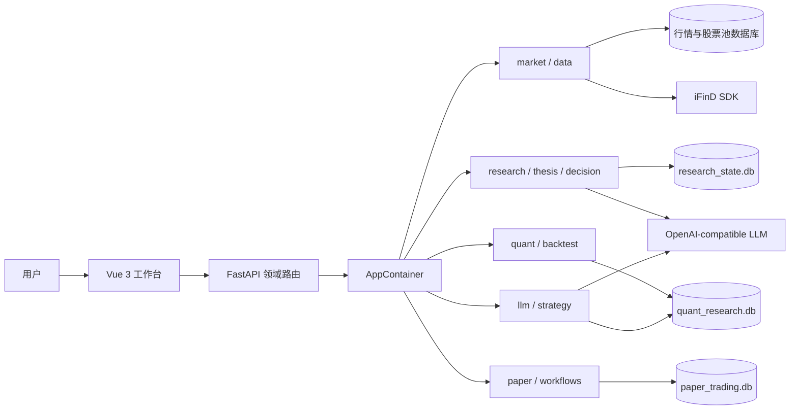
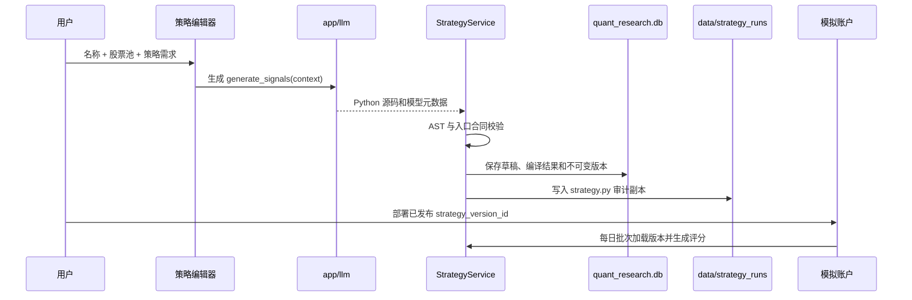

# 当前系统架构

> 更新日期：2026-08-07
> 事实源：当前 `app/`、`frontend/src/`、数据库迁移和 API 合同

迹研是面向 A 股的本地研究与模拟交易工作台。系统将行情、证据研究、量化分析、策略生成、人工审批和模拟成交放在同一个 FastAPI 单体中，通过多个 SQLite 数据库隔离数据所有权。

本文只描述当前已实现能力。早期阶段编号、一次性验收样本、测试数量和未来路线不再作为架构事实。

## 1. 总体结构



`app/main.py` 创建应用，`app/api/routers/registry.py` 组合领域 Router，`app/container.py` 是运行时依赖的唯一正式装配入口。前端构建产物由 FastAPI 提供，根路由默认进入模拟盘。

## 2. 领域职责

| 领域 | 主要代码 | 职责 |
|---|---|---|
| 基础设施 | `app/core/` | 配置、SQLite 连接、幂等迁移、运行事件、重试、熔断和可观测性 |
| 外部数据 | `app/data/ifind.py` | iFinD 登录、交易日、行情、证券资料、公告和实时报价 |
| 行情与股池 | `app/market/` | 本地日线只读查询、增量更新、复权库、股票池和成分快照 |
| 研究 | `app/research/` | 公告归档、PDF 解析、财务事实、Evidence、公司研究和质量验收 |
| 量化 | `app/quant/` | 因子定义、快照、评价、因子回测、模型注册、Shadow 和因子发布 |
| 回测内核 | `app/backtest/` | 日频账户循环、A 股交易规则、组合约束和目标组合合同 |
| 策略 | `app/strategy/` | 草稿、编译、不可变版本、代码校验、文件副本和运行适配 |
| 策略生成 | `app/llm/` | OpenAI-compatible 模型调用和策略生成 Prompt |
| 决策与论点 | `app/decision/`、`app/thesis/` | 决策案例、结果评价、组合规划和长期论点监控 |
| 模拟盘 | `app/paper/` | 账户、策略部署、提案、人工审批、实时行情、成交、持仓、净值和基准 |
| 工作流 | `app/workflows/` | 六步每日研究批次、幂等复用、失败恢复和事件关联 |

详细文件树见 [APP_STRUCTURE.md](APP_STRUCTURE.md)。

## 3. 数据库边界

| 数据库 | 写入方 | 主要内容 | 约束 |
|---|---|---|---|
| `stock_data.db` | 行情更新脚本 | 不复权日线和更新质量记录 | 应用查询只读；禁止写入复权价格 |
| `stock_data_qfq.db` | 复权构建/同步脚本 | `CPS:2` 前复权日线 | 因子、模型和回测研究使用 |
| `stock_data_hfq.db` | 复权构建脚本 | `CPS:1` 后复权日线 | 可选研究库，不进入默认主流程 |
| `stock_pool.db` | 股票池同步服务 | 股池定义和日期化成员 | 策略绑定 `pool_id`，历史研究需检查快照时点 |
| `research_state.db` | 研究、Thesis、决策、运行事件 | Evidence、文档、研究产物、案例、事件账本 | 不再承载模拟盘和量化领域的新写入 |
| `quant_research.db` | QuantStore、StrategyService | 因子、评价、回测、模型、Shadow、策略草稿和版本 | 策略版本和源码的权威记录 |
| `paper_trading.db` | PaperTradingService、DailyBatchStore | 账户、部署、批次、订单、成交、持仓、NAV、实时报价 | 模拟盘执行状态的权威记录 |

Schema 由各 Store 初始化时调用 `app/core/migrations.py::apply_migration()` 幂等更新，并将迁移 ID 写入各自数据库的 `schema_migration`。跨库拆分迁移采用“复制后切换所有权”的方式；回滚必须依赖操作前备份，不能假设旧库仍持续双写。

`data/strategy_runs/` 是已发布策略的文件级审计副本，不是策略权威数据库。应用启动时可从 `quant_research.db` 补齐缺失副本。

## 4. 核心数据流

### 4.1 行情与研究

```text
iFinD / 本地日线
  -> 行情合同与质量检查
  -> Evidence / 财务事实 / 公告页码
  -> ResearchRun 和不可变研究产物
  -> ResearchAssessment / Thesis / DecisionCase
```

确定性计算和模型语言推理分离：收益、因子、风险和时点由 Python 计算；模型负责在已提供证据内组织文本或生成策略代码。研究模型不可直接修改 Evidence、交易提案、仓位或人工审批状态。

### 4.2 因子与回测

`app/quant/factor_lab.py` 和相关服务管理因子版本与快照；`factor_evaluation.py` 计算 IC、分层和相关性；`factor_backtest.py` 调用共享 `app/backtest/` 内核运行成本后组合回测并保存结果。

`app/backtest/` 还被离线多因子脚本和模拟盘风险规则复用，但当前没有“任意已发布代码策略一键回测”的统一业务服务。前端 `/backtest` 的现有数据合同不能被解释为所有策略类型都已接入。

### 4.3 大模型代码策略



代码策略必须只定义一个 `generate_signals(context)`，返回股池内证券的 `security_code`、有限数值 `score` 和可选 `reason`。系统在执行前准备股池和特征上下文，输出不能越过绑定股池。

当前防线包括源码长度、AST 禁止项、隔离模式 Python 子进程、超时和输出校验。这是快速 MVP 的受限执行，不是容器、虚拟机或操作系统级安全沙箱，不能运行不可信第三方代码。

## 5. 每日研究与模拟盘

每日批次合同版本定义在 `app/workflows/daily_batch.py`，当前顺序为：

1. `market_data`：确认/补齐行情并尝试更新账户基准。
2. `factor_snapshot`：生成同研究日因子快照。
3. `current_shadow`：按账户策略生成或复用信号；部分策略可跳过。
4. `candidate_research`：对候选及现有持仓运行研究；未启用研究的策略可跳过。
5. `holdings_review`：检查现有持仓状态。
6. `order_proposals`：生成模拟盘提案。

批次按账户、研究日、批次版本和配置哈希复用。步骤结果和运行事件持久化；失败后再次运行会保留已完成步骤，只重试失败及后续步骤。服务重启时，正在运行的批次会转为失败并允许恢复。

### 5.1 审批与成交边界

- 完整批次只生成 `proposed` 订单，不自动批准，也不自动成交。
- 每条订单必须单独人工批准或拒绝。
- 前端“执行模拟撮合”调用实时撮合接口，只处理该账户最新未被替代批次中的 `approved` 订单。
- 实时撮合仅允许上海时区交易日 `09:30-11:30` 和 `13:00-15:00`。
- 行情日期必须是当天，成交日必须晚于提案研究日，报价时间必须晚于人工批准时间。
- 成交使用通过合同的 iFinD `latest` 实时报价，并继续应用 T+1、整手、费用、涨跌停、可用现金和可卖数量约束。
- 卖单优先于买单。持仓、现金、订单状态和 NAV 在成交后写入 `paper_trading.db`。

较新研究日的批次会取消或替代旧批次未成交提案，因此不会在周五同时执行周三和周四两套订单。历史提案和历史成交仍保留在台账中。

### 5.2 自动调度

`app/paper/scheduler.py` 每分钟检查已部署且配置 `auto_run=true`、`schedule=daily` 的账户，在配置时间之后运行当天完整研究批次。调度器仍返回 `approval_mode=manual`，不会代替用户批准或触发撮合。

## 6. 运行事件与可追溯性

`app/core/runtime_events.py` 已实现三层记录：

- `runtime_run`：根任务和输入哈希；
- `runtime_step_run`：步骤、尝试次数和结果哈希；
- `runtime_event`：按根任务连续编号的追加式事件。

事件载荷会清理密码、Token 和 API Key，并限制体积。每日研究批次已接入该账本。通用 `ToolResult` 表、声明式任务引擎和 SSE 仍属于提案，不是当前运行依赖。

## 7. 前端边界

Vue 3 是唯一生产前端，主要路由为：

| 路由 | 功能 |
|---|---|
| `/` | 模拟盘账户、批次、提案、成交、持仓和绩效 |
| `/company`、`/theses` | 公司研究和长期论点 |
| `/quant`、`/factor-development`、`/factor-evaluation` | 数据、因子开发与评价 |
| `/backtest`、`/factor-library` | 因子回测、Shadow 和因子发布 |
| `/strategies` | 大模型策略创建和已发布策略仓库 |
| `/decisions`、`/acceptance` | 决策案例、结果和证据质量验收 |

前端共享 API 客户端位于 `frontend/src/api/`。`openapi.generated.ts` 是生成文件；后端接口变化后应重新生成并通过类型检查。

## 8. 当前限制

1. 应用面向单用户本地环境，没有鉴权、租户隔离、正式任务队列或横向扩展。
2. SQLite 适合当前规模，但同一账户同一研究日并发启动不同配置批次，仍可能在订单提案唯一约束处竞争。运维上应避免自动批次与手工批次同时启动。
3. 部分股票池使用当前成分回填历史，会产生幸存者偏差；必须结合具体快照检查。
4. iFinD SDK 的底层调用不能被应用安全强杀；超时、重试和熔断只限制应用等待与重复调用。
5. 策略代码执行不是强隔离沙箱，且代码策略尚未统一接入前端综合回测。
6. 当前只进行模拟交易，不连接真实券商；短期回测、Shadow 或模拟盘收益都不能证明可实盘复现。
7. 行业、估值、完整财务 point-in-time、OCR 和复杂表格覆盖仍不完整。

## 9. 架构变更要求

- 新业务逻辑放入所属领域，跨领域组装放入 `app/container.py` 或 `app/workflows/`。
- 修改数据库必须增加幂等迁移、回滚影响说明和临时数据库测试。
- 修改策略、批次或撮合合同必须保存版本/哈希，并同步更新 [OPERATIONS.md](OPERATIONS.md)。
- 不允许恢复旧根模块导入，也不允许从 `example/` 建立生产运行依赖。
