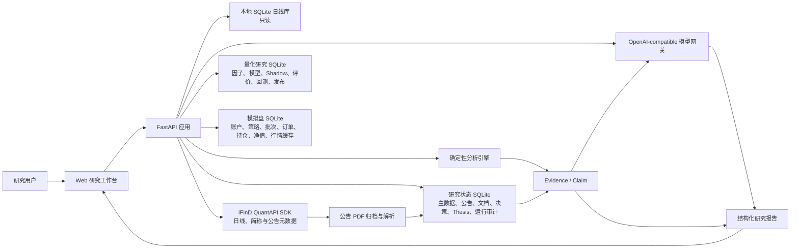
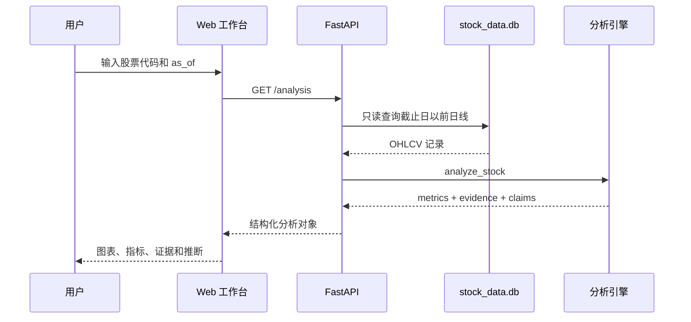
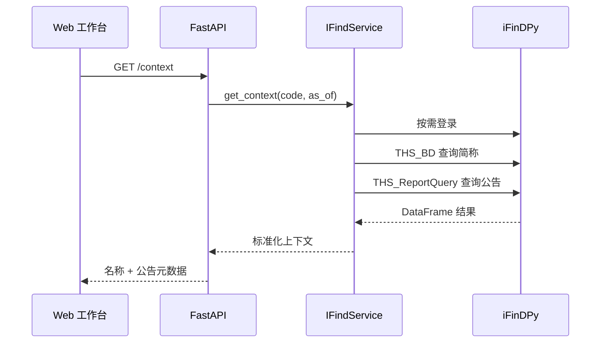
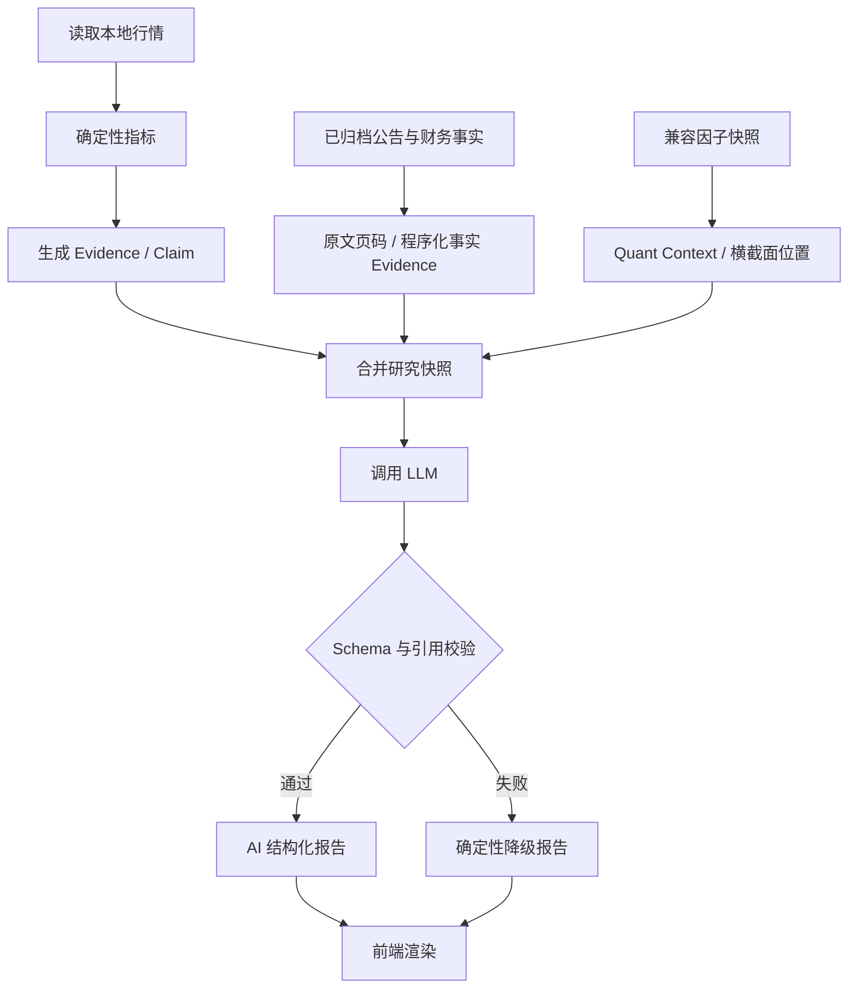
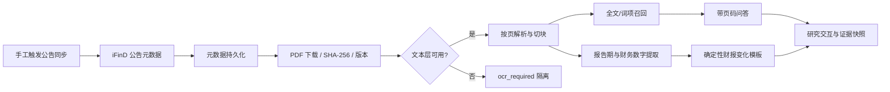
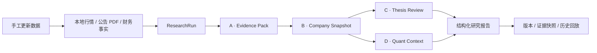
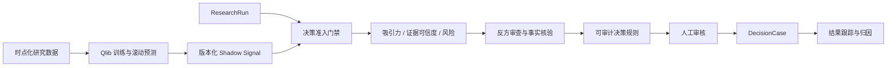
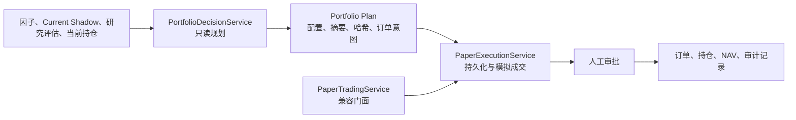

# 迹研 Evidence AI Research 架构书

> 文档版本：1.4  
> 对应应用版本：0.8.0  
> 更新日期：2026-07-24  
> 目标读者：项目维护者、后续开发者、研究流程设计者  
> 当前结论：项目处于 **MVP 0.12 / M0-M8 快速 MVP 完成**。系统已能对不可变 `DecisionCase` 追加完整周期的 `DecisionOutcome`，计算证券收益、基准超额收益和最大不利波动，并执行跨案例归因；全链路仍只用于 Shadow 研究评价，不授权交易。

## 1. 文档目的

本文描述迹研当前已经落地的系统架构、模块职责、数据流、运行方式、质量边界和后续演进路线。

本文刻意区分：

- **当前架构**：代码中已经存在并可运行的能力；
- **目标架构**：为实现 Evidence-first AI Research OS 仍需建设的能力；
- **项目阶段**：当前版本在整体路线中的真实位置。

本文不是投资策略说明，也不将当前技术指标输出解释为投资建议。

## 2. 项目定位

迹研是一个面向 A 股的本地证据型研究工作台。核心原则是：

> 数据必须有时间，结论必须有证据，推断必须有标记，论点必须能证伪。

系统当前关注四类研究动作：

1. 查询和整理股票历史行情；
2. 用确定性程序发现值得关注的价格、趋势、波动和流动性变化；
3. 将 Evidence 和 Claim 交给受约束的模型生成结构化研究摘要；
4. 保存 Thesis 及证伪条件，为持续监控建立数据基础。

当前明确不做：

- 自动下单和仓位调整；
- 输出无证据的买卖建议或目标价；
- 用大模型直接计算金融指标；
- 将技术指标变化等同于基本面变化；
- 在缺少公告、财务和行业证据时进行基本面归因。

## 3. 当前阶段判断

### 3.1 阶段结论

项目目前处于：

> **MVP 0.13：阶段 A-D 框架、M5-M8 决策闭环和 M11.1-M11.3 量化实验室均已完成快速 MVP。**

它已经不是静态页面原型：代码具备本地数据库访问、API、iFinD 与 LLM 网关、公告归档、PDF 解析、程序化财务事实、不可变证据快照、统一研究运行、手工 Claim 重评、全市场因子快照和候选池。M5 增加真实证据门禁；M6 增加模型注册、滚动 OOS 复核和当前 Shadow；M7 增加不可变决策案例、三维评分、确定性准入、风险边界与追加式人工审批；M8 增加不可变结果快照、完整周期收益、基准超额、MAE 与跨案例归因；M11.1-M11.3 增加前复权因子注册、评价和成本后策略回测。当前自动化测试基线为 **142 项通过**。这里的“可用”仍只表示单用户开发环境中的技术验收，不代表生产可用。

它还不是完整的“AI 研究助手”：Thesis 监控与因子快照均由用户手工触发；量化层只覆盖价格、波动和成交活跃度，已有单因子 Top-N 回测但不含历史成分、行业/市值中性化、估值和基本面因子；行业、同行比较及真实财报样本的长期抽取准确率仍待建设或验收。

### 3.2 能力完成度

| 能力域 | 当前状态 | 说明 |
|---|---|---|
| 本地日线数据访问 | 已完成 MVP | 数据库含 4,897 张个股表，2020-01-02 至 2026-07-20；不等同于 4,897 只当前有效上市证券 |
| 本地行情历史时点查询 | 已完成 MVP | API 支持 `as_of`，只读取截止日以前的本地日线；不代表公告/财务 point-in-time 已完成 |
| 确定性指标计算 | 已完成 MVP | 收益、均线、RSI、波动率、回撤、量比、52 周位置 |
| Evidence / Claim | 快速 MVP | 行情、公告和财务 Evidence 可进入统一快照；Company Snapshot 中带证据的确定性 Claim 可导入 Thesis 基线并持续比较 |
| AI 结构化报告 | 已完成 MVP | Schema 校验、证据 ID 校验、失败降级均已实现 |
| iFinD SDK 接入 | 已完成基础接入 | 从 `quant` 环境直接导入，支持简称、公告元数据和日线增量；普通本机终端已验证，手工触发更新 |
| 公告研究 | 已完成快速 MVP + M5 验收 | 元数据持久化、PDF/hash/版本、按页解析、轻量检索、带页码问答与引用校验已形成闭环；8 份真实文档金标通过，OCR 文本准确率和更大样本仍延期 |
| 证券主数据 | 建设中 | 4,897 条代码、交易所和行情覆盖日期已初始化；简称可由 iFinD 补充，真实上市日期、板块和行业待指标契约确认 |
| Thesis 管理 | 手工监控 MVP | 已有 CRUD、状态历史、监控基线、Claim 明细、证据差异、评估历史和人工确认；不自动修改 Thesis 状态 |
| 财务研究 | 程序化事实 MVP + M5 验收 | `financial-regex-v2` 可识别报告期和枚举行，从严格同一行双值中抽取 11 类指标；8 项真实金标数值、比较期和来源页全部通过，复杂表格与完整召回仍待建设 |
| 文档检索与问答 | 已完成快速 MVP | 已有 PDF 文本层检测、页内切块、轻量词项扩展、确定性排序、文档去重和页码引用；FTS5 表已创建并维护，但 MATCH/BM25 召回、OCR、向量检索和重排延期 |
| 问答/模板历史 | 已完成 MVP | 每次文档问答和财报模板保存结构化结果、模型元数据、完整证据 JSON 与快照 SHA-256，可回放历史记录 |
| 统一研究任务 | 已完成框架 MVP | `ResearchRun` 记录证券、截止日、工作流版本、状态和错误；Evidence Pack、Quant Context 与 Company Snapshot 作为带 Schema 版本和 SHA-256 的不可变产物保存并回放 |
| 持续监控 | 手工 MVP | 用户可比较基线与新 `ResearchRun`，按稳定业务键识别 Claim 证据变化并确认五类判断；无定时任务、事件触发和提醒 |
| 横截面量化辅助 | M11.3 快速 MVP | 全市场快照与候选池保持原链路；量化实验室新增前复权单因子评价和 Top-N 成本后回测，仍无历史成分、行业/市值中性化和估值因子 |
| 机器学习 Shadow 信号 | 当前观察 MVP | 已纳管 Alpha158/LightGBM 历史实验；冻结模型通过 14 个连续 OOS 窗口复核，并按严格数据合同生成 2026-07-20 沪深300全覆盖当前快照；不进入候选池或决策准入 |
| 受控决策案例 | M7 快速 MVP | 强制绑定周期、基准、ResearchRun、Artifact 哈希、Thesis、当前 Shadow 与策略版本；规则状态和人工审批分离，批准只进入 M8 Shadow 跟踪 |
| 结果评价与归因 | M8 快速 MVP | 使用 iFinD `CPS:2` 前复权收盘价；周期未满保持 pending；完整周期后确定性计算证券/基准/超额收益和 MAE，并按状态、周期、策略和评分分桶归因 |
| 真实证据验收 | M5 已完成 | 版本化 SHA-256 样本清单、12 项质量门禁、不可变运行、API 与验收台已落地；当前覆盖 3 家发行人，不代表全市场准确率 |
| 行业与同行比较 | 未开始 | 无行业历史、统一口径比较和产业链关系数据 |
| 生产运维 | 未开始 | 无容器化、鉴权、限流、审计平台和正式监控 |

### 3.3 P0 推进状态（2026-07-21）

| P0 项目 | 状态 | 说明 |
|---|---|---|
| `quant` 环境锁定 | 已完成基础版 | Python 3.11.15、直接依赖、精确版本锁和检查脚本已提交 |
| 日线口径确认 | 已完成 | 本地库和增量接口固定为 `THS_HD` 空参数不复权；实测 `CPS:1` 为调整后价格，禁止写入 |
| iFinD 日增量更新 | 已完成交易日感知的人工日更 | 按上海时区和 18:00 数据窗口确定候选截止日，再用 `THS_Date_Query` 核验真实交易日；仅对缺口执行空参数不复权 `THS_HD`，并保留 append-only、批次重试、二分降级、进程锁、质量隔离和运行日志 |
| 每日研究批次编排 | 已完成 v1.3 真实闭环 | 六步持久化状态机统一执行日线、主数据日期、因子、Current Shadow、候选与持仓研究、持仓复核和提案；持仓全量并入订单评价，冻结/保留仓位占用席位，成交阶段执行先卖后买与实际持仓数量门禁；支持幂等复用、失败续跑和页面进度，并由统一运行事件账本关联步骤、iFinD 与 LLM 调用；人工审批明确排除在自动步骤之外 |
| 源码凭据清理 | 已完成代码清理 | 示例已改读 `.env`；旧凭据是否进入历史、是否轮换仍需人工确认 |
| iFinD 生命周期 | 已完成基础版 | CLI 和 FastAPI 关闭时只注销本进程创建的会话 |
| iFinD 可观测性 | 已完成基础版 | 登录、日线、证券资料和公告调用记录耗时、数量、错误码与错误分类；健康接口提供 24 小时聚合，不记录秘密参数 |
| 行情质量门禁 | 已完成基础版 | SDK 结构变化整批回滚；OHLC/VWAP/成交量和超过 60% 的收盘跳变按股票隔离并记录证据 |
| iFinD / LLM 恢复策略 | 已完成基础版 | 请求超时、最多 3 次尝试、指数退避、连续 3 次可恢复故障熔断和 60 秒半开探测已实现 |
| 真实契约测试 | 部分完成 | 已对同一标的实测 `THS_HD("")` 与 `THS_HD("CPS:1")`；真实 LLM 契约和长期稳定性待验收 |
| 行情版本与公司行为规则 | 部分完成 | 已明确不复权并隔离异常跳变；公司行为数据自动核验仍需补充 |

### 3.4 对原实施路线的映射

| 路线阶段 | 当前判断 |
|---|---|
| 阶段 A：公告和财报助手 | **快速 MVP 与首批真实样本验收已完成**。公告元数据、PDF/hash、页码切块、问答引用、报告期识别和程序化财务事实已落地；OCR 文本准确率和复杂表格延期 |
| 阶段 B：结构化公司研究 | **快速 MVP 已完成**。统一公司快照组合行情、财报变化、最近公告、反方审查、边界和下一步核验；行业、同行、估值和独立事实核验仍延期 |
| 阶段 C：持续监控 | **手工 MVP 已完成**。Thesis 可绑定运行基线，程序按 Claim 比较证据并保存建议，用户确认增强/维持/减弱/证伪/无法判断；自动调度和通知延期 |
| 阶段 D：量化辅助 | **横截面快速 MVP 已完成**。已有 20/60 日动量、波动、最大回撤、52 周位置、20 日平均成交额、质量隔离、排序筛选和候选池；下一步以 Qlib 补齐时点化数据集、机器学习基线和样本外评估 |
| 第二阶段：AI 决策支持 | **M8 结果评价 MVP 已完成**。已有确定性准入、三维评分、风险边界、人工审批、完整周期结果和跨案例归因；下一步先完成 M8.1 批次与到期扫描，再积累真实成熟样本 |

### 3.5 整体进度快照

| 工作流层级 | 状态 | 当前可交付物 | 下一道门槛 |
|---|---|---|---|
| 运行基线 | 基础版完成 | `quant` 环境、依赖锁、手工行情更新、质量门禁、观测、重试与熔断 | 真实契约长期回归、备份和迁移 |
| DATA | 基础版完成 | 本地不复权日线、证券骨架、公告元数据、PDF 原件和哈希 | 主数据补全、公司行为和全量文档覆盖 |
| EVIDENCE | 快速 MVP + 首批验收完成 | 行情 Evidence、页码原文 Evidence、程序化财务事实、快照哈希、真实样本门禁 | 扩大财报样本、OCR 和复杂表格 |
| CLAIM / REPORT | 快速 MVP 完成 | 行情报告、文档问答、财报模板、统一公司快照和不可变运行产物 | 独立事实核验、行业/同行/估值模块 |
| THESIS / MONITOR | 手工 MVP 完成 | Thesis CRUD、状态历史、Claim 基线、证据差异、评估与人工确认 | 自动触发、通知、语义级论点影响分析 |
| QUANT / DECISION | M8 快速 MVP | 因子快照、当前 Shadow、不可变 DecisionCase/DecisionOutcome、完整周期相对收益、MAE 和分组归因 | M8.1 案例批次、到期扫描、批量评价和批次级归因 |
| 产品化 | MVP 0.12 | 单用户工作台、研究入口、监控、候选池、模型实验、证据验收、决策案例和结果评价页 | M8.1 样本运营工具；M9 继续受样本门槛约束 |

按功能闭环判断，项目已完成“数据接入可靠性 + 阶段 A-D + M5 证据验收 + M6 当前 Shadow + M7 受控决策案例 + M8 结果评价”。当前最合理的阶段名称是 **MVP 0.12 / 第二阶段 Shadow 评价闭环已形成**。尚未成熟的案例不会展示部分收益，低样本归因也不能解释为策略有效或 2026 年推荐。

## 4. 架构原则

### 4.1 Evidence-first

模型不能直接成为事实来源。当前研究链路先由程序生成 Evidence，再形成 Claim，最后才允许模型编辑报告。

### 4.2 确定性计算与语言推理分离

- Python 负责收益率、均线、波动率、回撤等精确计算；
- 模型负责摘要、组织、反方观点和下一步核验建议；
- 模型不得重新计算或补造输入中不存在的数字。

### 4.3 时间边界优先

行情查询支持 `as_of`。研究结果保存实际数据截止时间，避免将未来数据引入历史研究。

当前 iFinD 公告查询也使用研究截止日，但财务披露时间模型尚未建设，因此系统目前还不能声称实现了完整的 point-in-time 基本面研究。

### 4.4 可降级

- iFinD 不可用时，本地行情分析仍可运行；
- LLM 不可用、超时或输出校验失败时，返回确定性报告；
- 原始行情数据库始终以只读方式打开。

### 4.5 MVP 单体优先

当前使用 FastAPI 单体应用、SQLite 和原生前端。这个选择降低了个人/小团队阶段的部署成本。只有当数据量、并发和任务持续时间真正要求时，再引入 PostgreSQL、任务队列、对象存储和工作流引擎。

## 5. 系统上下文



### 5.1 状态数据库边界

`data/research_state.db` 是研究事实与审计库，持有证券主数据、公告、财务事实、研究产物、
决策、Thesis 和 `runtime_*` / iFinD 调用事件。`data/quant_research.db` 持有因子、模型、
Shadow、因子评价、回测和发布数据。`data/paper_trading.db` 是模拟交易域库，持有
`paper_strategy`、`paper_account`、`paper_daily_run`、`paper_order`、
`paper_position`、`paper_nav_snapshot`、实时行情、基准行情和每日批次表。

模拟盘读取证券名称和行业时，先从模拟盘库读取持仓或订单，再批量查询研究库的
`security_master`，不执行跨数据库 JOIN。迁移 `0014` 和 `0015` 首次启动时从旧研究库
复制历史数据；迁移完成后模拟盘写入只进入新库。每个数据库独立维护
`schema_migration` 日志。

量化库保留一张启动时从研究库批量 UPSERT 的 `security_master` 只读投影，用于高频列表
查询和本地 JOIN；研究库仍是证券主数据唯一事实来源。决策案例只保存 Shadow 快照 ID，
由 `QuantStore` 在服务边界验证，不建立跨 SQLite 文件外键。量化迁移 `0017` 至 `0021`
按核心、因子实验、评价、回测和发布顺序复制。正式模式由 `0022` 删除研究库中的
旧模拟盘和量化表，不提供运行时旧库回退；灾难恢复使用迁移前备份。

## 6. 运行时组件

### 6.1 Web 与 API 层

入口：`app/main.py`

职责：

- 初始化 FastAPI、行情仓库、iFinD 服务和 Thesis 存储；
- 暴露健康检查、股票分析、外部上下文、研究报告和 Thesis API；
- 将同步 iFinD SDK 调用放入线程池，避免直接阻塞异步事件循环；
- 将 HTTP 请求转换为业务服务调用，并把领域异常映射为稳定的 HTTP 状态；
- 统一公司研究由 `app/company_research.py` 的 `CompanyResearchService` 编排，API、模拟盘候选研究和每日批次共用同一业务入口，不再互相调用路由函数。

当前 API：

| 方法 | 路径 | 用途 |
|---|---|---|
| GET | `/` | 返回研究工作台 |
| GET | `/api/health` | 数据库、LLM、iFinD 状态 |
| GET | `/api/securities` | 按代码或已知简称搜索股票 |
| GET | `/api/stocks/{code}/analysis` | 本地日线确定性分析 |
| GET | `/api/stocks/{code}/context` | iFinD 简称和近期公告元数据 |
| GET | `/api/ifind/status` | iFinD SDK 和配置状态 |
| POST | `/api/research` | 生成 AI 或确定性降级报告 |
| POST | `/api/research-runs` | 运行统一公司研究，持久化 Evidence Pack、Quant Context 与 Company Snapshot；可接收候选来源快照 ID |
| GET | `/api/stocks/{code}/research-runs` | 查询证券的公司研究运行历史 |
| GET | `/api/research-runs/{id}` | 回放研究运行及其不可变版本化产物 |
| POST | `/api/document-assistant` | 基于已归档公告/财报原文进行带页码引用的问答 |
| POST | `/api/financial-change-template` | 生成固定五栏、逐栏引用或明确未覆盖的财报变化模板 |
| POST | `/api/stocks/{code}/financial-facts/refresh` | 重建已归档财报的报告期和程序化财务事实 |
| GET | `/api/stocks/{code}/financial-facts` | 查询最新报告期、带原文页码的确定性财务事实 |
| GET | `/api/stocks/{code}/assistant-history` | 查询该证券的问答与模板历史 |
| GET | `/api/research-interactions/{id}` | 回放结构化结果与不可变证据快照 |
| POST | `/api/stocks/{code}/announcements/sync` | 手工同步公告，支持优先归档财报与业绩公告 |
| GET/POST | `/api/theses` | 查询或建立研究论点 |
| PATCH/DELETE | `/api/theses/{id}` | 更新状态或删除论点 |
| GET | `/api/theses/{id}/monitor` | 查询 Thesis 基线、Claim 和历史评估 |
| POST | `/api/theses/{id}/monitor/baseline` | 以指定或最新成功运行建立监控基线 |
| POST | `/api/theses/{id}/monitor/check` | 比较基线与指定或最新后续运行并保存评估 |
| PATCH | `/api/claim-evaluations/{id}` | 人工确认 Claim 的五类判断之一 |
| POST | `/api/factor-snapshots` | 按指定或本地最新行情日手工生成/复用全市场因子快照 |
| GET | `/api/factor-snapshots/latest` | 查询最新成功因子快照及质量覆盖统计 |
| GET | `/api/factor-snapshots/{id}/securities` | 按质量、市场和因子阈值筛选排序证券 |
| GET/POST | `/api/research-candidates` | 查询候选池或加入通过质量门禁的证券 |
| DELETE | `/api/research-candidates/{code}` | 从研究候选池移除证券 |
| POST | `/api/evidence-acceptance-runs` | 对当前归档证据运行 M5 门禁并保存或复用不可变快照 |
| GET | `/api/evidence-acceptance-runs/latest` | 查询最近一次证据验收完整结果 |
| GET | `/api/evidence-acceptance-runs` | 查询验收运行历史 |
| GET | `/api/evidence-acceptance-runs/{id}` | 回放指定验收快照 |

### 6.2 本地行情访问层

入口：`app/data_access.py`

数据源：`data/stock_data.db`

当前数据事实（统计时间：2026-07-21；统计方式：遍历 SQLite 中 `stock_%` 表并汇总各表最小/最大日期）：

- SQLite 文件约 624 MiB；
- 4,897 张个股表；该数字是表数量，不包含“当前有效上市”“已退市”“历史名称”等主数据判断；
- 全局日期范围为 2020-01-02 至 2026-07-20；
- 表名格式为 `stock_<code>_<market>`；
- 字段为 `time/open/high/low/close/vwap/volume`；
- 数据库连接使用 SQLite URI `mode=ro`；
- 中途停牌时部分价格和成交量字段可能为空。

主要职责：

- 股票代码标准化和市场后缀推断；
- 防止用户输入直接成为任意表名；
- 读取指定起止日期的日线记录；
- 提供股票存在性、数据范围和搜索能力。

当前限制：

- 每只股票一张表，不利于横截面批量查询；
- `security_master` 已从行情表初始化，但真实上市/退市日期、板块、行业和历史名称仍不完整；
- 股票简称仅在 iFinD 查询或已知名称覆盖后补充；
- 行情更新运行和质量问题已单独记录，但原始个股表本身不携带复权口径、批次和采集时间；
- 没有指数、行业成分和公司行为数据。

### 6.3 确定性分析层

入口：`app/analysis.py`、`app/quant.py`；公共基础实现位于 `app/primitives.py`。

`primitives.py` 是以下基础契约的唯一实现：周期收益、年化波动率、最大回撤、
规范化 JSON 与 SHA-256、A 股代码/行情表名/Qlib instrument 转换。研究页允许在
窗口不足时显示部分历史统计，因子质量门禁仍要求完整 60/250 日窗口；两种业务口径
通过显式参数选择，不再各自复制计算公式。原模块继续兼容导出既有代码转换函数名。

当前指标：

- 1/5/20/60/120/250 日收益；
- MA20、MA60、MA120；
- RSI14；
- 60 日年化波动率；
- 250 日最大回撤；
- 20 日量比；
- 距 52 周高点距离和 52 周区间位置；
- 基于价格与均线位置的趋势状态；
- 最新交易日停牌识别。

输出不是单一评分，而是：

```text
security
as_of
coverage
metrics
evidence[]
claims[]
uncertainties[]
series
```

Evidence 包含：标识、类别、标签、值、截止时间、来源和计算方法。Claim 包含：陈述、事实/推断类型、置信度、证据 ID、反方证据和证伪条件。

### 6.4 iFinD 适配层

入口：`app/ifind.py`

依赖方式：在 `quant` 环境使用方法二安装 `iFinDAPI==0.0.8`，应用直接 `import iFinDPy`，不再跨 conda 环境加载。

认证配置：

```dotenv
IFIND_USER=...
IFIND_PASSWORD=...
```

当前调用：

- `THS_iFinDLogin`：按需登录；返回 `0` 或 `-201` 视为可用；
- `THS_BD`：查询股票简称；
- `THS_ReportQuery`：查询指定截止日前一年的公告元数据。

实现特征：

- 使用进程内锁避免并发重复登录；
- 结果转换为普通字典；
- 上下文在内存缓存 10 分钟；
- 最多向前端返回 20 条公告，最多将 5 条加入 Evidence；
- 公告标题只证明公告已发布，不直接支持内容结论。

当前限制：

- 缓存仅在单进程内有效；
- iFinDAPI 0.0.8 不暴露原生请求 timeout；应用超时可以及时失败和阻止重叠调用，但不能安全强杀仍在 DLL 中执行的调用；
- 有调用次数和错误统计，但尚无账号配额上限与主动限流；
- 公告同步和行情更新均由用户手工触发，暂不自动调度；
- 公告归档只下载同步范围内符合条件的有限数量文档，不代表公告正文全量覆盖；
- Codex 受限沙箱中 SDK 登录可能失败，普通本机终端运行正常。

公告证据处理由 `app/announcement_pipeline.py`、`app/document_pipeline.py` 和 `app/research_store.py` 完成：公告元数据增量写入研究状态库，PDF 按 SHA-256 存储并保留版本，文本按页解析和切块；无有效文本层或疑似乱码的文件进入 `ocr_required`，不会静默进入问答。

### 6.5 LLM 网关与报告层

入口：`app/llm.py`、`app/schemas.py`

当前模型接口为 OpenAI-compatible `/chat/completions`。模型只接收已经生成的结构化分析对象。

控制措施：

1. System Prompt 禁止模型补充外部事实和未来价格预测；
2. Pydantic `AIReport` 校验输出结构；
3. 每个 AI Claim 必须引用输入中存在的 Evidence ID；
4. 模型调用失败、超时、JSON 无效或引用非法时，自动返回确定性报告；
5. 模型元数据记录模型名、提供方和 token usage。
6. iFinD 与 LLM 均实施请求截止时间、有限重试、指数退避和进程内熔断；
7. 文档问答与财报模板保存完整输入证据快照及 SHA-256，历史回放不重新检索；
8. 财务数字由 `financial-regex-v2` 和 Decimal 计算，模型不得重新计算变化率。

当前限制：

- 有调用级日志、重试和熔断，但没有完整成本台账、跨模块 trace ID、缓存、主动限流和模型路由；
- 没有独立事实核验调用；
- 公告正文问答和统一公司研究快照均有专门 Schema 与引用约束；行业、同行和估值节点仍未建立；
- 文档问答与财报模板已持久化，通用 `/api/research` 报告仍没有版本历史。

### 6.6 Thesis 状态层

入口：`app/state.py`

数据源：`data/research_state.db`

当前 Thesis 字段：

```text
id
security_code
title
core_claim
horizon
status
invalidating_conditions
created_at
updated_at
```

支持状态：观察、验证中、基本成立、证据减弱、已经证伪、研究终止。

监控相关表：

- `thesis_monitor_baseline`：每个 Thesis 当前基线运行、截止日、工作流版本和证据哈希；
- `thesis_claim`：来源 Claim、表述、类型、置信度、基线 Evidence ID 和不可变证据 JSON；
- `claim_evaluation`：当前运行、程序建议、证据变化、人工结论和确认时间；
- `thesis_status_history`：用户手工修改 Thesis 状态的审计历史。

监控比较只使用稳定业务键：行情使用 Evidence ID，财务使用 `metric_code`，公告原文使用 `announcement_id + page`。同一基线与当前运行的评估通过唯一约束幂等保存。

当前限制：

- 第一版只导入 Company Snapshot 中引用确定性 Evidence 的 Claim，不将用户自由文本核心论点自动拆解或语义绑定；
- 新公告和财报不会自动触发研究运行或监控检查，用户需要先手工更新数据、生成新运行并点击检查；
- 程序不推断方向性变化，只建议“维持”或“无法判断”；增强、减弱和证伪必须人工确认；
- Claim 评估不会自动修改 Thesis 状态；
- 尚无 Catalyst 表、通知、任务调度和跨 Thesis 影响检索。

### 6.7 横截面量化层

入口：`app/quant.py`、`app/data_access.py`、`app/research_store.py`

运行方式：用户手工触发。`StockRepository.iter_histories()` 复用一个只读 SQLite 连接，逐表读取截止日以前最近 320 条记录；因子服务在内存中计算约 4,897 行结果，再由状态库事务批量保存。因子版本为 `price-liquidity-v1`。

可复现边界：

- `factor_snapshot` 保存 `as_of`、因子版本、源库字节大小、纳秒修改时间和证券数构成的 SHA-256 输入指纹；
- 相同截止日、版本和输入指纹直接复用历史快照；
- 每只证券同时保存因子值、有效观察数、最近交易日、质量状态和机器可读原因；
- 候选池保存来源快照 ID，后续行情更新不会改写当时的因子值；
- 候选准入或列表回放时，对主数据中缺失的简称使用 iFinD `THS_BD` 批量补全并持久化；补全失败不阻塞候选池；
- 公司研究优先使用显式候选来源快照，否则选择不晚于研究截止日的最近成功快照；未来快照会被拒绝；
- `Quant Context` 保存质量状态、质量原因、七项因子、通过质量门禁的横截面名次和百分位，并作为 `quant-context-v1` 不可变产物进入 `ResearchRun`；
- 被质量隔离的证券不计算正常横截面排名，量化因子不自动转化为基本面 Claim。

当前限制：

- 源库指纹不是全文件内容哈希；它适合本地手工更新流程，但不能抵御文件内容被原地篡改且大小、修改时间完全伪造的情况；
- 20 日平均成交额使用 `VWAP × volume`，没有流通股本，因此不能称为换手率；
- 不复权行情使收益和波动可能受公司行为影响，超过 60% 的单日跳变会隔离，但较小公司行为仍需后续数据核验；
- 原全市场候选链路仍没有行业中性化、ST/退市状态、完整涨跌停可交易性、估值和基本面因子；M11.3 回测只覆盖当前沪深300单因子组合与简化交易成本。

### 6.8 前端工作台

入口：`frontend/src/main.ts`、`frontend/src/App.vue`、`frontend/src/router/index.ts`；生产构建输出到 `frontend/dist`，由 FastAPI 在站点根路径提供，API 保留 `/api` 前缀。

当前功能：

- 一级导航已按用户任务收敛为“模拟盘、公司研究、量化实验室、评价与审计”四个工作区；模拟盘为默认首页；
- 公司分析/长期论点、因子扫描/模型与信号、案例评价/质量验收分别通过二级标签访问，原七个业务视图和 API 合同保持不变；
- 全局证券搜索和观察名单“进入研究”会携带上下文跳转至公司研究，不再依赖旧一级页面；
- 股票代码/简称搜索和快捷股票切换；
- 研究截止日选择；
- 价格、MA20 和成交量图；
- 关键指标条；
- Evidence、Claim、AI 报告标签页；
- iFinD 数据源状态和公告原文链接；
- 公告/财报手工归档、文档原文问答和带页码证据展示；
- 固定五栏财报变化模板和程序化财务事实台账；
- 问答与模板历史列表、快照 ID/hash 和历史结果回放；
- Thesis 新建、列表、状态更新和删除；
- Thesis 基线设置、Claim 数和待确认数、证据差异展开与五类人工结论确认；
- 全市场因子快照生成、质量覆盖、组合筛选、排序、候选池增删和进入公司研究；
- 候选进入研究时保留来源快照，报告展示横截面因子、排名、质量状态和产物哈希；
- 因子扫描、观察名单、模型信号和模拟盘共用证券名称/代码组件、状态徽标及百分比、金额、置信度格式；
- 模拟盘候选和订单提供统一“决策依据”抽屉，直接回放六项量化风险门禁、ResearchAssessment、失效条件、组合约束和拒绝原因；
- 每日决策按“数据与研究、市场复核、人工审批、持仓监控”四步组织，动态指出当前待办并提供页面内跳转；市场扫描前置，交易提案、持仓和净值按决策顺序排列；
- 决策依据可携带证券代码与研究截止日直接进入公司研究，减少跨工作区重复搜索和日期错配；
- 桌面侧栏与移动端四栏底部导航均支持工作区收敛，二级标签在窄屏下保持可读；
- API 错误提示和报告加载状态。

当前限制：

- 没有用户账户和权限；
- 没有研究项目、组合或自选股持久化；
- 图表为自绘 Canvas，缺少复权切换、事件标记和指标配置；
- 报告不能导出、分享、评论或保存版本；
- 公告 PDF 可在浏览器打开，但还没有页内高亮和精准引用定位；
- 研究任务仍在 HTTP 请求内同步执行，没有节点级进度推送、暂停与恢复。

## 7. 核心数据流

### 7.1 股票分析



### 7.2 iFinD 上下文增强



### 7.3 研究报告生成



### 7.4 公告与财报证据闭环



## 8. 数据模型与可信度边界

### 8.1 当前输入与验证状态

- 本地日线表中的已存储价格和成交量：已确认当前使用不复权口径，具备结构门禁、OHLC/VWAP/成交量校验和异常跳变隔离；公司行为自动核验仍未完成；
- 程序基于这些字段计算出的确定性指标：算法可单元测试，结果可信度仍继承输入数据质量；
- iFinD 返回的证券简称和公告元数据：公告元数据已持久化，调用有观测与恢复策略；真实 SDK 的长期契约回归仍不足；
- 已归档 PDF：保存来源 URL、抓取时间、SHA-256、版本和页码；`ocr_required` 文档不参与内容回答；
- 程序化财务事实：保存报告期、比较期、原始值、标准化值、单位、来源页、文档哈希和抽取版本；首批 8 项真实金标准确通过，但仅接受严格同一行双值，不代表完整报表召回；
- 研究交互：文档问答和财报模板保存不可变证据 JSON 与快照哈希；
- 用户手动保存的 Thesis 内容和状态：属于用户研究记录，不是客观事实。

### 8.2 当前不能直接证明的内容

- 未被程序化事实或引用原文覆盖的公司收入、利润、现金流和财务质量；
- 未归档、解析失败、需要 OCR 或检索未命中的公告正文内容；
- 行业景气、供需、价格和库存；
- 市场一致预期和估值隐含假设；
- 价格变化的基本面原因；
- 未来收益或目标价。

### 8.3 来源等级

当前本地行情和 iFinD 是结构化输入来源，不能在缺少授权、版本、口径和质量校验时直接等同于“已验证事实”。后续必须保留对法定披露原文的回链，并将来源明确划分为：

```text
官方披露事实
结构化数据服务
公司表述
第三方观点
AI 推断
```

## 9. 配置与部署

### 9.1 运行环境

- Windows；
- conda `quant` 环境；
- Python 3.11；
- FastAPI + Uvicorn；
- `iFinDAPI==0.0.8` 通过方法二安装在 `quant` 环境；
- 浏览器访问 Uvicorn 实际绑定端口；默认启动为 `http://127.0.0.1:8000`。

启动命令：

```powershell
conda activate quant
python run.py
```

iFinD SDK 对本地设备和运行环境敏感。普通本机终端运行已验证可登录；受限沙箱中的进程可能返回 SDK 登录错误，因此正式运行应使用普通本机终端或受支持的服务账户环境。

运行还依赖以下外部前提：

- 已获得允许使用的 `data/stock_data.db`，并了解其采集来源和复权口径；
- iFinD 账号具有 QuantAPI SDK 权限，本机满足厂商许可和组件要求；
- LLM 网关兼容 `/chat/completions`、`response_format=json_object` 和当前模型名称；
- `.env` 已配置，但未提交到版本控制；
- `data/research_state.db` 可写，行情数据库只读。

项目已提供 `environment.yml`、直接依赖清单、精确 `requirements.lock` 和环境检查脚本；当前验证基线为 `quant` 环境中的 Python 3.11.15 与 iFinDAPI 0.0.8。

### 9.2 配置项

| 配置 | 用途 |
|---|---|
| `TRADINGAGENTS_LLM_BACKEND_URL` | OpenAI-compatible 网关地址 |
| `OPENAI_COMPATIBLE_API_KEY` | 模型网关密钥 |
| `TRADINGAGENTS_QUICK_THINK_LLM` | 快速研究模型 |
| `TRADINGAGENTS_DEEP_THINK_LLM` | 深度研究模型 |
| `IFIND_USER` | iFinD 数据接口账号 |
| `IFIND_PASSWORD` | iFinD 数据接口密码 |
| `IFIND_TIMEOUT_SECONDS` / `IFIND_MAX_ATTEMPTS` / `IFIND_BACKOFF_SECONDS` | iFinD 应用截止时间、最多尝试次数和退避基数 |
| `IFIND_CIRCUIT_FAILURE_THRESHOLD` / `IFIND_CIRCUIT_RECOVERY_SECONDS` | iFinD 熔断阈值和恢复窗口 |
| `LLM_CONNECT_TIMEOUT_SECONDS` / `LLM_READ_TIMEOUT_SECONDS` | LLM 连接和读取超时 |
| `LLM_MAX_ATTEMPTS` / `LLM_BACKOFF_SECONDS` | LLM 最多尝试次数和退避基数 |
| `LLM_CIRCUIT_FAILURE_THRESHOLD` / `LLM_CIRCUIT_RECOVERY_SECONDS` | LLM 熔断阈值和恢复窗口 |

`.env` 由应用启动时加载。配置值不得出现在日志、API 响应或版本控制中。

### 9.3 当前部署局限

- 仅绑定 `127.0.0.1`，适合单机使用；
- 无 HTTPS、用户认证和多租户隔离；
- 没有进程管理器和自动重启；
- 状态库已有统一迁移日志，但还没有独立迁移 CLI、回滚和自动备份；
- 已有 conda 环境声明和精确依赖锁，但没有容器镜像和一键部署；
- SQLite 写入适合单用户，不适合高并发服务。

## 10. 安全、可靠性与可观测性

### 10.1 已有措施

- 行情库以只读模式连接；
- 股票代码经过正则标准化后才映射表名；
- Pydantic 校验外部请求和模型输出；
- 前端对动态文本进行 HTML 转义；
- 公告链接只接受 `http/https`；
- API 状态不返回账号、密码或 token；
- iFinD 和 LLM 失败均有降级路径。

### 10.2 主要风险

| 优先级 | 风险 | 影响 |
|---|---|---|
| P0 | 历史示例凭据是否进入过版本历史、是否已轮换仍需人工确认 | 凭据泄露和账号滥用 |
| P0 | 真实 iFinD/LLM 契约只完成局部人工验证，缺少长期回归 | SDK、权限或模型变更可能破坏研究流程 |
| P1 | 公告正文不是全量归档，OCR 和复杂表格延期 | 研究助手可能正确拒答，但会存在证据覆盖缺口 |
| P1 | 旧通用 `/api/research` 仍未纳入统一运行；正式工作流应使用 `/api/research-runs` | 误用旧入口时报告不能按统一产物契约复现 |
| P1 | 财务抽取首批 8 项真实金标全部通过，但仅覆盖 3 家发行人的选定行 | 样本代表性和完整召回不足，不能外推为全市场准确率 |
| P1 | 已有 iFinD 结构化调用事件，但没有跨 iFinD/LLM/API 的统一 trace ID | 跨服务失败仍需人工关联 |
| P1 | iFinD 已显式注销并统计调用，但没有账号配额上限和主动限流 | 流量预算仍不可控 |
| P2 | SQLite 状态库已有统一迁移日志，但无回滚和备份机制 | 破坏性 Schema 变更和灾难恢复仍需人工处理 |

## 11. 测试现状

当前自动化测试基线为 **131 passed**，以单元测试和进程内集成测试为主，覆盖：

- 股票代码市场后缀推断；
- 分析结果 Evidence/Claim 引用关系；
- 停牌日量能处理；
- iFinD 状态响应不泄露凭据；
- iFinD DataFrame 转换；
- 公告元数据转 Evidence；
- iFinD 临时错误重试、认证错误快速失败；
- LLM 503 重试、401 快速失败和连续超时熔断；
- 熔断器关闭/打开/半开状态转换和 iFinD 不可取消调用的重叠保护；
- 行情更新质量门禁、隔离和运行记录；
- PDF URL 校验、下载、解析、切块和 OCR 隔离；
- 公告持久化、轻量检索排序、页码证据和快照回放；
- 报告期识别、单位归一化、财务事实抽取、拒绝规则和五栏模板。
- Thesis 基线导入、稳定业务键差异比较、运行兼容性门禁、评估幂等和人工确认。
- 全市场因子计算、质量隔离、输入幂等、筛选分页和候选池准入。
- Quant Context 的横截面排名、质量排除、历史截止日兼容和未来快照拒绝。
- 候选快照到三类 ResearchArtifact、Company Snapshot、Thesis 基线、第二次运行和 Claim 重评的 M4 端到端链路。
- iFinD 多证券简称的单批次查询、结果映射和候选主数据补全。
- M5 金标文档/财务事实、PDF 物理哈希、页块与引用完整性、缺失文件失败和验收运行幂等。
- M6 模型产物指纹、滚动 OOS 窗口、当前推理数据合同、拒绝快照留痕及当前信号持久化。
- M7 DecisionCase 幂等快照、三轴评分、流动性硬排除、过期来源拒绝、审批准入和追加式审批历史。

当前缺口：

- 完整 API 与浏览器端到端测试；
- 更大规模、更多发行人和更多异常版式的真实样本回归；
- iFinD 登录和查询契约测试；
- 真实 LLM 网关的超时、非法 JSON 和非法 Evidence ID 契约回归；
- Thesis API CRUD 集成测试；
- 浏览器交互和响应式回归测试；
- 大样本财务数字准确率、修订口径和完整 point-in-time 测试；
- 跨报告独立可比期核验和公司行为未来函数检测。

## 12. 更快的 A-D 骨架 MVP 路线

### 12.1 路线调整

不再采用“阶段 A 全部做深后再进入 B、B 完成后再进入 C”的瀑布式推进。阶段 A 的 OCR、复杂表格、完整主数据和大规模检索可以持续增强，但不应阻塞 C、D 的最小闭环。

下一目标是先把 A-D 各压缩为一个最小研究动作，并由统一 `ResearchRun` 串联：



这里的 A-D 是四个受控工作流节点，不是四个自由 Agent。数据更新与研究运行保持分离：iFinD 行情和公告继续由用户手工更新，`ResearchRun` 只读取已持久化数据并明确显示缺失项，保证运行可复现。

### 12.2 M0：统一研究任务（已完成）

新增最小数据契约：

- `research_run`：证券、`as_of`、状态、工作流版本、输入截止时间、开始/结束时间和错误；
- `research_artifact`：运行节点、Schema 版本、结构化 JSON、快照哈希和生成时间；
- 统一 Evidence 适配器：复用行情 Evidence、文档页码 Evidence 和财务事实 Evidence；
- 显式 Python 编排服务：按固定节点执行并记录状态，不引入 LangGraph 或任务队列。

验收标准：一次研究运行有稳定 ID；每个节点成功、缺证据或失败均可见；历史产物不因后续重新检索而变化。

### 12.3 M1：贯通阶段 A+B（已完成）

基于已有公告、财务事实和行情分析，生成统一公司研究快照：

1. 数据覆盖和缺口；
2. 财报变化；
3. 重要公告与事件；
4. 行情、趋势、波动和流动性状态；
5. 风险、反方观点和证伪条件；
6. 数据截止时间及完整证据列表。

模型只负责摘要、反方观点和表达；所有数字、变化率和因子值由程序生成。没有证据的栏目明确标记 `not_covered`，不得补造。

验收标准：用户从一个入口生成公司研究快照；关键数字都能回链到财务事实或行情计算；所有内容 Claim 都引用本次运行中的 Evidence ID。

### 12.4 M2：阶段 C 手工监控 MVP（已完成）

现有 Thesis 已增加：

- `thesis_monitor_baseline`：Thesis 对应的基线运行、工作流版本、截止日和证据哈希；
- `thesis_claim`：从 Company Snapshot 导入、可独立跟踪的确定性事实 Claim 及基线证据 JSON；
- `claim_evaluation`：基线运行、当前运行、判断、理由和人工确认状态；
- `thesis_status_history`：Thesis 状态变更历史。

第一版由用户点击“检查更新”，比较基线 `ResearchRun` 与最新后续运行。行情按 Evidence ID、财务按 `metric_code`、公告按 `announcement_id + page` 稳定匹配，不比较整个运行 JSON。程序只在 Claim 表述和证据均不变时建议“维持”，其他情况建议“无法判断”；“增强、减弱、证伪”等方向性结论必须由用户确认，且确认不会自动修改 Thesis 状态。暂不增加每日自动任务、消息通知和催化剂日历。

当前验收结果：可建立或重置基线、幂等保存同一次比较、列出新增/删除/变化证据、人工确认五类判断并保留历史；更换基线时旧待确认项标记为已取代而不删除，已确认项永久保留；证券、工作流版本和截止日不兼容的运行会被拒绝。第一版仅导入 Company Snapshot 中带 Evidence ID 的确定性 Claim，不对用户自由文本核心论点做语义绑定。

### 12.5 M3：阶段 D 横截面 MVP（已完成）

保留现有 4,897 张个股行情表，不迁移全量历史。手工批处理从原库按 `as_of` 生成：

- `factor_snapshot`：截止日、因子版本、行情库大小与修改时间组成的数据源指纹、状态、覆盖统计和错误；
- `security_factor_snapshot`：每个证券的一行因子与质量原因；
- `research_candidate`：用户选入的证券及其来源快照。

当前因子：

- 20/60 日动量；
- 60 日年化波动率；
- 20 日平均成交额（`VWAP × volume`）和当日量比；
- 250 日最大回撤；
- 52 周位置；
- 数据覆盖和质量状态；
- 因子版本与计算截止日。

质量门禁要求至少 251 个有效收盘、最新交易日距截止日不超过 10 天、最新日非停牌、OHLC/VWAP/成交量合法、流动性样本足够，并隔离窗口内绝对值超过 60% 的未复权价格跳变。前端支持代码/简称、市场、质量状态、动量、波动率和成交额组合筛选，以及七种字段排序和候选池增删。该阶段只称为价格/流动性量化辅助，不将其描述为完整质量、成长或估值因子体系，也不连接交易。

真实验收（2026-07-21）：以 `2026-07-20` 为截止日扫描 4,897 只证券约耗时 28.3 秒；4,118 只进入正常排名，779 只质量隔离。同一行情库指纹和截止日重复运行复用原快照；`20日收益 ≥ 50%` 的真实筛选得到 11 只；候选池增删和进入研究动作通过浏览器验收。质量异常不会进入正常排名。

### 12.6 M4：工作台与端到端验收（已完成）

M4 将 M3 的发现入口接入 M0-M2 的研究与监控合同：

- `company-research-v2` 接收可选的候选来源 `factor_snapshot_id`；
- 显式快照必须存在、已完成且不晚于研究截止日，普通研究自动选择最近兼容快照；
- 每次运行固定保存 `evidence-pack-v1`、`quant-context-v1`、`company-snapshot-v2` 三类不可变产物；
- Company Snapshot 显示量化覆盖、因子值、全市场排名和百分位；质量异常证券显式排除且不生成正常排名；
- 候选池“进入研究”保留来源快照，独立搜索证券会清除候选来源；
- 历史运行回放使用当时的 Quant Context，不重新读取最新因子；
- 端到端回归覆盖因子快照、候选选择、公司研究、三产物回放、Thesis 基线、第二次运行和 Claim 评估。

M4 完成后得到 A-D 的“框架 MVP”，不是各阶段的完整生产版本。旧 `company-research-v1` 运行仍可回放，但不能与 v2 运行直接建立监控比较，这是防止跨契约误比较的预期行为。

### 12.7 M5：真实样本与证据验收（已完成）

M5 将阶段 A 的“能够运行”变成可量化、可回放的证据质量门禁：

- `data/acceptance/evidence_acceptance_v1.json` 以 PDF SHA-256 固定 8 份人工核验文档和 8 项财务事实；
- `EvidenceAcceptanceService` 检查 PDF 物理哈希、解析覆盖、文档状态、必需原文、OCR 隔离、财务数值与来源页、页块哈希、研究引用和时点边界；
- 持久化事实必须与当前 `financial-regex-v2` 重跑结果一致，防止规则升级后旧数据静默残留；
- `evidence_acceptance_run` 按清单哈希与数据指纹幂等保存，历史结果不会被后续数据覆盖；
- FastAPI 提供运行、最新结果、历史和指定快照接口，前端“证据验收”视图展示门禁、金标、失败项、哈希和已知边界。

2026-07-22 首次正式运行结果：12/12 门禁通过；35/35 PDF 文件哈希完整，32/35 可解析（91.43%，阈值 85%），其余 3 份隔离为 `ocr_required`；8/8 金标文档、12/12 必需原文、8/8 金标财务事实、54/54 持久化事实、1,373/1,373 页块、70/70 研究文档引用和 154/154 时点检查通过。最终验收快照为 `aca5dd6a56d5538ab371603f658e2f289d1f3d9dd8f96369a3d7568d7292262d`。

该结果只证明当前清单覆盖范围内的正确性。OCR 样本仅验证“正确隔离”，未验证 OCR 文字；财务金标是选定行而非完整报表召回；当前仅覆盖宁德时代、贵州茅台和紫金矿业三家发行人。

## 13. 当前优先级与明确延期

### 13.1 路线调整：提前进入第二阶段

M5 已经给出首批可重复证据基线，因此不再把“大规模扩充公告和财报覆盖”设为进入第二阶段的前置条件。下一主线调整为 **Qlib + 机器学习 Shadow 预测 + 受控决策支持**，目标不是让模型直接荐股，而是把第一阶段的 Evidence、Claim、Thesis 和 Quant Context 转成有时间周期、有基准、有风险边界、可以事后验证的决策案例。

继续使用现有 `FastAPI + Python + SQLite + 显式工作流` 单体。Qlib 是离线数据、训练、预测和评估组件，不另建自由 Agent 系统；大模型仍只参与解释、情景构建和反方问题，准入、特征、标签、评分、风险限制和结果评价由确定性程序完成。



### 13.2 M6：Qlib 决策数据底座与机器学习基线

M6 复用并纳管用户既有实验，不重复训练。当前已经完成 **当前 Shadow MVP**：先审计模型产物，再对冻结模型的完整历史样本外预测做连续窗口复核，最后在严格数据合同下执行当前截面推理。这里的“滚动样本外验证”是对 2017-2020 固定 OOS 预测按 63 个交易日分窗评价，**不是滚动重训或 walk-forward retraining**。

2026-07-22 环境与导入结果：

- `quant` 使用 Python 3.11.15，通过 pip 安装 `pyqlib==0.9.7`，LightGBM 为 4.6.0；
- 已导入 MLflow 实验 `937502219828981168` 下运行 `a11a5663c34a477aafe9fc0c466193a4`；
- 模型为 Qlib `LGBModel` + Alpha158，训练期 2008-2014、验证期 2015-2016、测试预测期 2017-01-03 至 2020-07-31；
- 已持久化 261,300 条信号、452 个历史证券、871 个交易日；最近截面包含 300 个证券；
- Rank IC 为 0.0490，成本后年化超额收益为 0.0807，成本后最大回撤为 -0.0861；这些是原实验历史指标，不是项目重新训练或独立复核出的当前表现；
- `params.pkl`、`pred.pkl`、`label.pkl` 的路径、SHA-256、大小和导入源指纹均已固化。

滚动 OOS 复核结果：

- 验证 ID：`e5b11c67dc52d853423d3dd37c80ee3138a1a5edfaad37a47ce15e60de41bd19`，状态 `passed`；
- 868 个有效交易日按 63 日划分为 14 个连续窗口，13 个窗口的平均 Rank IC 为正；
- 平均 Rank IC `0.04905`，Rank ICIR `0.40675`，正 IC 日占比 `66.82%`，正窗口占比 `92.86%`；
- 日均 top-bottom 标签差 `0.28636%`；这些指标支持发布为待评价 Shadow，不构成收益承诺或交易准入。

已落地的数据合同：

- `model_run` 保存框架、模型、特征集、证券池、时间切分、配置、指标、用途和限制；
- `model_artifact` 保存可信产物的绝对路径、SHA-256 与字节数；
- `prediction_snapshot` 固化预测范围、行数、证券数、交易日数和内容指纹；
- `shadow_signal` 保存逐日逐证券得分、截面名次、分位和已实现标签；
- 相同运行和指纹可幂等重导入；同一运行 ID 对应不同指纹时拒绝覆盖。
- `model_validation_run` 保存验证窗口、指标、门禁、状态和验证指纹；
- `current_shadow_snapshot` 保存当前证券池、输入范围、特征合同、数据指纹、门禁与发布状态；
- `current_shadow_signal` 保存当前逐证券得分、截面名次和分位，不保存尚未实现的未来标签。

当前推理数据合同：

- 证券池固定为 iFinD 查询时点的沪深300成分股，并将成员列表固化进快照；
- OHLC 使用 iFinD `CPS:2` 前复权，VWAP 用 `raw_vwap * adjusted_close / raw_close` 对齐到相同价格尺度；
- 不复权数据优先读取本地 `stock_data.db`，当前成分股本地缺表时才使用 iFinD 同口径回补；
- 停牌或上市前空行按逐日可用性处理，不把结构性空值误判成整只证券失败；
- 模型 SHA-256、Alpha158 列数、有限值比例、覆盖率、日期边界和价格关系全部通过后才发布；失败快照同样持久化，但不发布任何信号。

2026-07-20 当前快照：

- 快照 ID：`3699241113268372272dadab2b78d1eeff02a038b2f8db069604198a44152abc`；
- 状态 `current_shadow_ready`，沪深300证券/信号 `300/300`，覆盖率 `100%`；
- 输入范围 2025-11-24 至 2026-07-20，158 个 Qlib 日历日，158 个 Alpha158 特征；
- 特征有限值比例 `100%`，VWAP 对齐覆盖 `99.80799%`，13 项当前门禁全部通过；
- 数据指纹 `a5fd062d72f609d4f4c8fd25ef2fd83b21122c397b06078731a18cadd707fd58`。

产品边界：

- 前端“模型实验”默认展示当前 Shadow 的验证状态、数据合同、门禁和信号，并保留历史回放切换；
- 信号不进入研究候选池、不改变候选资格；M7 只允许将其作为 `DecisionCase.attractiveness` 的显式分项，不能覆盖证据、风险或准入门禁；
- 历史实验使用下载的 Qlib CSI300 数据；当前推理使用独立固化的 iFinD/本地输入 provider，二者来源不会被界面隐藏；
- 当前截面尚无实现标签，统一标记为“待评价”；
- 原实验仍是单次训练/验证/测试切分。窗口复核衡量其 OOS 时段稳定性，但不能替代跨市场阶段的滚动重训验证。

本次 M6 验收结果：模型运行、产物哈希、滚动 OOS 验证、当前输入 provider、门禁、数据指纹和任一信号均可追溯；门禁失败会留下拒绝快照且不发布信号；全量自动化测试 **78 项通过**。

M6 后续维护项：

1. 持续积累当前信号的实现标签，监控 Rank IC、分组收益、换手和市场阶段衰减；
2. 建立历史成分股与公司行为主数据，进一步缩小当前成分股用于历史复核的幸存者偏差风险；
3. 在确有重训需求时另立版本化 walk-forward 训练流程，禁止覆盖当前冻结模型结论；
4. 当前 Shadow 继续保持观察用途；进入 `DecisionCase` 不代表获得候选池或交易资格。

### 13.3 M7：受控决策支持 MVP

M7 已新增 `DecisionCase`，强制绑定 `security`、`as_of`、`decision_horizon`、`benchmark`、ResearchRun、三类 Artifact 哈希、Thesis、当前 Shadow、验证运行、策略版本和人工结论。规则状态限定为：

```text
excluded
insufficient_evidence
watch
research_required
eligible_for_review
```

决策前先运行确定性准入门禁，当前 `decision-policy-v1.1` 检查研究/信号截止日一致性、Artifact SHA-256、行情/财务/公告覆盖、量化质量、滚动 OOS、Thesis 状态与基线、待确认 Claim、流动性、波动率和回撤。未通过准入的证券不得因为模型分数高而进入后续审查。

评分保留三个独立维度，不压成一个无法解释的总分：

- `attractiveness`：基本面、估值、催化剂、相对强弱及机器学习信号；
- `evidence_confidence`：关键事实、引用、冲突、时点和数据新鲜度；
- `risk_severity`：财务治理、估值、周期、事件、流动性和集中度风险。

机器学习预测只影响 `attractiveness` 的一个可见分项，不能覆盖证据可信度、风险红旗或准入结果。规则阈值、特征、模型、工作流和证据快照全部版本化；规则状态和人工决定使用不同字段。

已落地的持久化与审批合同：

- `decision_case` 保存周期、基准、来源 ID/哈希、三轴评分、门禁、风险边界、完整快照和快照 SHA-256；相同输入幂等复用，历史案例不可覆盖；
- `decision_case_review` 追加人工审批事件。决定限定为 `approve_for_tracking`、`return_for_research`、`reject`；
- 只有 `eligible_for_review` 可以批准，且批准仅表示进入 M8 Shadow 跟踪；其他状态只能退回研究或拒绝；
- 已完成审批的案例不可二次覆盖，研究或策略变化后必须创建新案例；
- 被新策略替代的旧案例保留审计但禁止审批。

2026-07-22 真实样本验收：宁德时代 `2026-07-20 / 60交易日 / 沪深300` 案例绑定最新 `company-research-v2`、完整 Evidence/Company/Quant Artifact、Thesis 和当前 Shadow。修正 Shadow 分位尺度后的 `decision-policy-v1.1` 得分为吸引力 `42.1`、证据可信度 `100.0`、风险严重度 `52.99`。唯一失败门禁为 `thesis_baseline_current`：Thesis 基线仍绑定更早 ResearchRun，因此规则正确返回 `research_required`，页面不展示“进入 Shadow 跟踪”按钮。

### 13.4 M8：结果评价与跨案例归因

M8 已建立追加式 `DecisionOutcome`。结果固定绑定 `DecisionCase.snapshot_hash`、策略版本、评价版本和行情指纹；同一数据指纹幂等复用，新行情只追加新快照，已经完成的历史结果不得覆盖。

- 数据源固定为 iFinD `THS_HD`，证券和基准均声明 `CPS:2` 前复权合同；
- 入场为案例截止日当日或之后首个有效收盘，第 N 个后续证券交易观察为退出；
- 未走完周期时状态保持 `pending`，只显示进度，不计算或展示部分收益；
- 完整周期确定性计算证券总收益、基准总收益、超额收益和相对入场收盘价的 MAE；
- 日期重复、非正价格、复权口径错误或基准日期无法对齐时标记 `data_rejected`；
- 归因只取每个案例最新的 `completed` 结果，按规则状态、审批状态、周期、策略、基准和三类评分桶汇总；样本少于 5 明确标记为低样本。

M8 当前没有加入论点事件、人工修改原因和模拟组合级归因，这些属于后续扩展，不影响单案例结果合同。

2026-07-22 真实运行：宁德时代 `2026-07-20 / 60d / 沪深300` 案例通过 iFinD 前复权合同完成首次评价，状态为 `pending`，进度 `2 / 60`，剩余 58 个交易观察。系统没有计算或展示部分收益。

### 13.5 M8.1：案例批次与到期扫描（下一工程项）

M8 的计算与存储合同已经完成，但当前仍需逐案例建立和评价。为稳定积累真实样本，下一工程项不是提前开放 M9，而是增加：

- 预设 Shadow 高分、中间和低分/规则失败区间的抽样清单；
- 不可变建案批次，冻结统一截止日和成员，避免结果出现后选择样本；
- `20d` 为主、少量 `60d` 并行的到期队列；
- 一次手工触发批量评价所有 pending 案例；
- 按批次、证券和持有期重叠情况执行归因，避免把相关案例视为完全独立样本；
- 数据拒绝率、到期覆盖率和选择偏差监控。

M8.1 继续保持手工触发，不恢复每日自动任务。它是计划项，当前代码尚未实现批次表、到期扫描或批量评价 API。

### 13.6 真实成熟案例与 M9 准入

真实成熟案例必须在结果发生前冻结 DecisionCase，走完完整 N 个交易观察，通过前复权和基准对齐合同，并以 `DecisionOutcome.status=completed` 收口。已经知道结果后倒填的案例、未完整到期的部分收益和事后删除的失败样本均不得进入评价集。

建议每周固定建立 6–10 个案例，覆盖 Shadow 高、中、低分区间和不同规则/审批状态；第一批以 `20d` 快速反馈为主，同时保留少量 `60d` 队列。规则未通过或人工拒绝的案例仍应计算结果，它们是验证门禁是否减少尾部损失的必要对照。

样本治理门槛如下：

- 少于 5：只验证单案例和工程链路；
- 5–29：只验证分桶、归因和数据合同；
- 30–99：允许探索分布，不允许开放 M9；
- 至少 100 个完整案例、关键分组各至少 30 个、覆盖至少 6 个不同建案批次，且跨时期表现稳定：才进入 M9 准入评审。

这些数量不是统计显著性的保证。同一证券、相邻日期和重叠周期会降低有效样本量，必须增加批次级结果、Bootstrap 置信区间和集中度检查。

### 13.7 M9：足量 Shadow 样本后有限开放

只有在不同周期积累足量成熟案例、数据拒绝率可控、跨案例结果稳定且研究流程可复现后，才讨论有限决策状态。M9 仍不等于接入真实交易或让模型直接给仓位。

只有在不同市场阶段的 Shadow 样本中确认高低分组具有稳定区分度、置信度基本校准、排除规则确实减少尾部损失后，M9 才向用户开放 `consider_entry`、`hold`、`consider_reduction` 等有限决策状态。M9 仍不自动交易。

### 13.8 证据增强维护轨

以下工作从主线前置条件改为维护轨，不阻塞 M6-M8：

- 增加发行人、报告类型和异常版式金标；
- OCR 文本准确率、复杂版面和跨页表格；
- 向量检索、重排模型和知识图谱；
- 公告财报助手的全面产品化优化。

维护轨必须保留两个约束：现有 M5 质量门禁不得回退；当某项缺口阻塞 `DecisionCase` 的关键 Claim、财务特征或准入判断时，按真实失败样本定向补齐。由此避免为覆盖率而覆盖，也避免机器学习建立在已知错误事实之上。

### 13.9 继续延期

- 自动调度、LangGraph、多 Agent、Redis 和任务队列；
- PostgreSQL 全量迁移、React 重写和容器化；
- 深度学习、强化学习、端到端荐股和自动交易；
- 在 M9 准入评审前接入真实交易账户或用模型信号自动调整组合。

## 14. 架构演进触发条件

| 当前方案 | 保持使用的条件 | 升级触发条件 |
|---|---|---|
| FastAPI 单体 | 单用户、小团队、低并发 | 多用户、独立任务伸缩或权限边界出现 |
| SQLite 状态库 | 单进程低频写入 | 多用户并发、审计和复杂查询增加 |
| 个股分表 SQLite | 个股查询为主 | 横截面扫描和全市场因子计算变慢 |
| 进程内缓存 | 单进程、短期上下文 | 多进程部署或需要跨重启复用 |
| 普通 Python 工作流 | 请求内任务可完成 | 长任务需要暂停、恢复、人工审批 |
| 原生前端 | 页面数量少、团队规模小 | 复杂状态管理、路由和组件体系扩大 |

## 15. 项目完成定义

### 阶段 A 完成

- 公告和财报可稳定采集；
- 原始文件、版本、发布时间和哈希可追溯；
- 文本和表格可解析；
- 问答返回原文与页码；
- 财务数字来自结构化事实服务；
- 历史 `as_of` 不泄露未来数据。

当前阶段 A 满足快速 MVP，但还没有满足以上完整定义：OCR/复杂表格、正文覆盖率和完整财务 point-in-time 仍存在缺口。

### A-D 骨架 MVP 完成

- 一次 `ResearchRun` 能串联 Evidence Pack、Company Snapshot、Thesis Review 和 Quant Context；
- 公司快照中的关键数字和内容结论具有可回放证据；
- Thesis/Claim 可以基于两次研究运行进行手工差异重评；
- 全市场基础价格因子快照可以生成候选研究池；
- 每个节点支持成功、证据不足和失败状态，不因局部失败伪造完整结论；
- 同一历史运行可以按工作流版本和输入快照复现。

### 第一阶段“AI 研究助手”完成

- 阶段 A 已完成；
- 公司研究模板和同行比较可用；
- 反方审查和事实核验为强制节点；
- Thesis/Claim 能被新信息持续重评；
- 报告和证据版本可复现；
- 有数据质量、引用支持率和风险漏报等评价指标；
- 人类可以审核、纠错和终止工作流。

### 第二阶段“AI 决策支持”快速 MVP

- Qlib 数据集、特征、标签、证券池和训练配置具有严格 `as_of` 与版本；
- 至少一个机器学习模型完成滚动样本外评估，并与简单规则基线同口径比较；
- 机器学习结果以不可变 Shadow Signal 保存，不直接生成交易指令；
- `DecisionCase` 强制包含决策周期、基准、准入结果、三轴评分、风险边界和人工结论；
- 决策规则可审计，重大红旗或证据不足能够否决高模型分数；
- `DecisionOutcome` 能在周期结束后计算相对收益、最大不利波动并回放当时全部版本。

### 生产可用

- 完成身份认证、权限、审计、备份和密钥治理；
- 有可重复部署、迁移、监控、告警和恢复流程；
- 有真实数据和真实任务上的回归评估；
- 关键结论引用支持率、数字准确率和漏报率达到预设门槛；
- 数据授权和使用范围经过确认。

## 16. 当前最重要的结论

当前原型已经验证了八项架构可行性，仍需扩大样本和长期运行进一步确认：

1. 本地 A 股日线可以被组织为带时间边界的确定性研究证据；
2. 模型输出可以通过 Schema 和 Evidence ID 被约束，而不是自由生成；
3. iFinD 公告可以被持久化为带文件哈希、页码和版本的原文证据；
4. 严格规则可以从部分财报文本中提取可审计数字，并由程序生成比较结果；
5. 问答和财报模板可以保存不可变证据快照并历史回放。
6. 现有个股分表可以在约 30 秒内生成带质量隔离的全市场因子快照，不需要提前迁移历史行情。
7. 候选来源和横截面位置可以作为不可变 Quant Context，与公司研究、历史回放和 Thesis 手工重评串成同一闭环。
8. 真实 PDF、财务金标、引用和时点边界可以通过版本化清单形成可重复、不可变的质量门禁。

当前最大的主线缺口已经转变为“每日模拟盘尚未形成跨市场状态、足量交易日和稳定成本假设下的表现记录”。M8 长周期评价继续保留，但不再阻塞用户对每日研究、持仓诊断和模拟交易闭环的使用。

当前已进入 **M9-lite 每日模拟盘 MVP**：使用通过严格数据合同的 Current Shadow 生成候选，以 `paper-evidence-risk-v3` 将 ResearchAssessment 接入确定性风险引擎，人工逐笔审批，并在研究日后的首个可交易开盘价模拟成交。该系统不连接真实券商，也不得把几日盈亏解释为稳定盈利证据。下一步按日积累 NAV、换手、费用、最大回撤和提案/审批/成交记录，同时补充基准净值、正式行业主数据和组合风险诊断。真实交易接口继续延期。

## 17. M9-lite 每日模拟盘（2026-07-23）

### 17.1 已完成

- `paper_account`：默认虚拟资金 100 万元、现金和基准合同；
- `paper_daily_run`：绑定同日因子快照、Current Shadow、策略版本和不可变输入哈希；
- `paper_order`：`proposed → approved/rejected → filled` 人工门禁；
- `paper_position`：持仓数量、可卖数量、成本和已实现盈亏；
- `paper_nav_snapshot`：现金、市值、净值、日收益、累计收益、回撤、仓位和换手；
- `paper_realtime_quote`：仅持久化通过合同的 `THS_RQ` 点时快照，包含交易所时间、接收时间、用途、原始响应和 SHA-256；明确不使用高频数据；
- v2 候选门禁：因子质量正常、至少 251 个观察、20 日平均成交额至少 1 亿元、60 日波动率不超过 80%、250 日回撤不超过 50%，且截止日 OHLC 与成交量可交易；
- v2 组合规则：从 Shadow 前 30 名中选择最多 5 只，目标总仓位 50%，按 60 日波动率倒数分配，单票 5%–12%，A 股 100 股整数手；
- 集中度规则：正式一级行业字段存在时单行业不超过 20%、最多 2 只；行业字段缺失时明确降级为 60 日收益相关性上限 0.85；
- 撮合规则：只允许研究日后的首个可交易开盘价；停牌、无成交量和一字涨跌停继续等待，加入 5bp 滑点、佣金和卖出印花税；
- 实时规则：只查询持仓、已批准待成交证券和基准；订单引用 `execution_quote_id`，9:30 后批准的订单禁止倒填当日开盘价；
- UI：组合概览、持仓、市场扫描、提案审批和净值台账；
- 2026-07-22 因子快照：4,897 只，4,121 只通过质量门禁；
- 2026-07-22 Current Shadow：300/300 覆盖，13 项数据与模型门禁全部通过；
- v1 首批提案保留审计记录并标记为策略替代；v2 的 5 笔订单已于 2026-07-23 使用 `THS_RQ` 官方开盘价完成模拟成交，6 个查询标的全部返回且通过合同；
- v2 真实批次从 Shadow 前 30 名中有 12 只通过全部证券级风险门禁，最终选择江西铜业、圣邦股份、藏格矿业、药明康德和豪威集团；
- 当前行业覆盖为 `0/4906`，因此真实批次的行业控制状态必须显示 `correlation_proxy`，不能宣称正式行业中性化已完成。

### 17.2 每日人工流程

1. 手工补齐当日日线并完成行情质量门禁；
2. 生成当日全市场因子快照；
3. 使用至少 500 个自然日历史生成 Current Shadow；
4. 打开“每日决策”，运行今日研究并检查持仓与候选；
5. 人工逐笔批准或拒绝提案；
6. 下一交易日开盘后打开模拟盘页面，以 `THS_RQ` 每 60 秒刷新持仓、待成交证券和基准；
7. 对 09:30 前已批准订单按官方开盘价模拟撮合，并检查 `execution_quote_id` 与未成交原因；
8. 收盘后补齐正式日线，执行日终 NAV、费用、回撤、换手和集中度对账。

### 17.3 下一优化顺序

1. 接入沪深 300 前复权基准日线，补全每日/累计超额收益；
2. 补齐 ST/退市状态、真实上市日期和涨跌停比例合同，并把固定成交额门槛升级为订单容量比例；
3. 通过经验证的 iFinD 指标契约补齐申万一级行业和历史变更，将 `correlation_proxy` 升级为正式行业上限；
4. 增加组合预期波动率、边际风险贡献、相关矩阵和行业暴露诊断；
5. 增加每日一键编排，但仍保持手工触发与逐笔审批；
6. 建立策略版本并行 Shadow 账户，避免在同一账户上边跑边改规则；
7. 至少跨越多个市场状态后再讨论真实资金，小样本盈利不作为放开依据。

## 18. ResearchAssessment 确定性研究准入（2026-07-23）

### 18.1 工件与职责边界

- 每个新 ResearchRun 生成第四类不可变工件 `research_assessment / research-assessment-v1`；
- 工件绑定 Evidence Pack、Company Snapshot 的 Artifact ID 与 SHA-256；
- LLM 只输出基本面方向、带 Evidence ID 的事实、重大负面、催化剂、证据置信度和可核验失效条件；
- `evidence-admission-v1` 根据覆盖、引用、哈希、置信度和负面类别映射 `admit / reduce / defer / veto`；
- LLM 输出中不存在最终信号和仓位字段，不能覆盖量化硬风险门禁或人工审批。

### 18.2 模拟盘语义

- `admit`：目标权重乘数 1.0；
- `reduce`：目标权重乘数 0.5，释放风险预算保留现金；
- `defer`：禁止新仓，已有仓位在量化门禁仍通过时冻结；
- `veto`：禁止新仓，已有仓位生成退出提案；
- 缺失、非当日、旧策略或哈希不一致的评估强制 `defer`；
- 账户存在更晚成交记录时禁止生成回溯研究批次。

### 18.3 首次真实样本

2026-07-22 时点的 5 个量化研究目标已完成公告/财报同步和 AI 结构化评估：藏格矿业、药明康德为 `admit`；江西铜业、圣邦股份、豪威集团为 `reduce`。5 个工件均使用 `evidence-admission-v1`，无同步失败。该批评估尚未回溯修改 2026-07-23 已成交的 v2 持仓；首个 v3 批次必须等待 2026-07-23 收盘数据链完成。

## 19. M10.0 统一运行事件账本（2026-07-23）

### 19.1 已完成

- 新增 `runtime_run / runtime_step_run / runtime_event`，事件合同版本为 `research.event.v1`；
- 每个 v1.3 每日批次以 `batch_id` 作为 `root_run_id`，六个步骤的每次尝试都有独立 `step_run_id`；
- Task、Step、iFinD 和 LLM 事件按根运行连续编号，工具重试共享同一 `call_id`；
- iFinD 原调用日志增加 `root_run_id / step_run_id / runtime_call_id`，保留既有健康统计；
- LLM 只持久化模型、操作、尝试次数和 usage 摘要，不保存完整 prompt、回答或 API Key；
- payload 递归脱敏、64KB 截断、SHA-256 校验，事件类型受白名单约束；
- 新增运行快照和 `after_seq` 增量事件 API，分页 `has_more` 使用额外一条记录准确判断；
- 失败批次可续跑已完成步骤，服务重启会将中断运行显式记为失败，后续事件序号继续递增；
- `quant` 环境全量回归结果为 `124 passed`。

### 19.2 当前边界与下一步

M10.0 只解决统一关联、持久化审计和增量读取。现有领域表仍保存 Evidence、Artifact、
Shadow、风险结论和订单事实，事件不能覆盖这些业务事实。前端当前仍使用原批次轮询，
没有接入 SSE；步骤 handler 仍返回普通 `dict`。

下一项是 M10.1：建立 ToolResult 合同、结果表和 ToolExecutor，先适配 iFinD 与 LLM，
再适配六个批次步骤。M10.1 必须沿用现有适配器的唯一重试层，并保持 LLM 无权直接
修改 Evidence、准入、仓位和订单。声明式 Task Contract 留在 M10.2，增量事件 UI 与
SSE 留在 M10.3。

## 20. 代码结构收敛第三步（2026-07-24）

### 20.1 模拟盘职责拆分

- `app/portfolio_decision.py` 的 `PortfolioDecisionService` 是组合决策的唯一入口：校验因子与 Current Shadow、执行证券硬门禁和 ResearchAssessment 校验、复核持仓、实施行业/相关性约束、计算目标权重并生成订单意图；
- `paper_strategy` 保存不可变策略标识、版本、信号来源和默认风险参数；`paper_account.strategy_id` 将账户绑定到策略合同。当前提供 Current Shadow LightGBM 排名和线性多因子排名，两者共享同一组合、审批与执行引擎；
- Vue Paper 工作区通过 `/api/paper/accounts` 和 `/api/paper/strategies` 创建、切换账户，所有研究、批次、行情和撮合命令显式携带当前 `account_id`；
- 组合决策只返回确定性计划，不写入 `paper_account`、`paper_daily_run`、`paper_order`、`paper_position`、实时行情或净值表；
- `app/paper_trading.py` 的 `PaperExecutionService` 负责账户状态、计划持久化、人工审批、模拟撮合、持仓、实时点时行情和 NAV；
- 原 `PaperTradingService` 保留为兼容门面，现有 API 和脚本无须改名；旧的重复组合决策代码已删除，策略版本、门禁、仓位算法、快照哈希和成交规则不变。

调用关系固定为：



### 20.2 统一状态库迁移入口

- `app/migrations.py` 提供共享 `apply_migration()` 和 `schema_migration` 日志；
- 研究核心、Thesis、模拟盘、每日批次、运行事件、iFinD 可观测性和模拟盘指数基准缓存依次使用 `0001` 至 `0007` 迁移 ID；
- 服务重启或组件重复初始化时，已经登记的迁移不会重复执行；启动状态恢复仍作为每次运行的独立步骤，不混入一次性 Schema 迁移；
- 行情库中的个股表、更新日志和复权库构建属于行情数据产品生命周期，不写入研究状态库的迁移日志。

本步新增职责边界、计划持久化和迁移幂等测试；`quant` 环境全量回归为 **131 passed**。

### 20.3 前端信息架构收敛第一阶段

- 默认首页由单股研究改为“每日决策”，直接呈现每日批次、实时状态、组合、持仓、提案、市场扫描和净值；
- “研究台 + 论点库”归入公司研究，“候选池 + 模型实验”归入量化实验室，“决策案例 + 证据验收”归入评价与审计；
- 人工候选池在界面中改称“人工观察名单”，明确它不直接作为模拟盘订单来源；
- 原生 HTML/CSS/JavaScript 和七个旧视图节点继续复用，仅增加统一工作区路由与二级标签，不修改后端 API；
- 浏览器验收覆盖四个一级入口、六个二级标签、全局证券搜索跨区跳转、375px 移动布局、重复 ID 和控制台错误；`quant` 环境全量回归仍为 **131 passed**。

### 20.4 前端信息架构收敛第二阶段

- 建立共享的证券标识、状态徽标、百分比、金额和证据置信度格式化函数，统一因子扫描、人工观察名单、Current/Historical Shadow 和模拟盘的展示语义；
- `admit / reduce / defer / veto` 统一显示为“准入 / 降权 / 暂缓 / 否决”，置信度不再使用收益率式正号，缺失值统一显示为 `—`；
- 模拟盘市场扫描和交易提案增加只读“决策依据”抽屉，展示快照中原有的因子质量、样本数、流动性、波动、回撤、可交易性，以及研究理由、负面/催化数量、失效条件、目标权重、行业和相关性；
- 抽屉明确保留权限边界：研究结论不能覆盖确定性风险门禁、直接设置仓位或自动批准订单；关闭按钮、遮罩和 `Escape` 均可退出；
- 未新增业务模块，未修改后端 API、数据库或策略计算。浏览器使用 2026-07-23 真实模拟盘快照验证六项门禁和移动端无横向溢出；`quant` 环境全量回归为 **131 passed**。

### 20.5 前端信息架构收敛第三阶段

- 每日决策新增动态流程条，将现有能力明确串成“数据与研究 → 市场复核 → 人工审批 → 持仓监控”；流程状态完全读取批次、研究运行、订单和持仓快照，不创造新的业务状态；
- 顶部根据真实状态显示唯一当前待办，例如“需要人工审核 N 笔交易提案”或“今日研究已完成，监控 N 只持仓”，主按钮只负责跳转到对应区域，不自动批准、撮合或修改数据；
- 页面顺序调整为完整批次、账户摘要、市场扫描与研究准入、交易提案与当前持仓、净值记录，使阅读顺序与实际决策顺序一致；
- 顶部保留“运行完整批次”为主操作，刷新行情、实时撮合、仅研究候选和仅生成提案收进“手动工具”，原按钮 ID、事件和 API 不变；
- 候选“决策依据”增加“进入公司研究”，携带证券代码和该次模拟盘研究日跳转到公司研究工作区；不会自动生成报告或改变 ResearchAssessment；
- 桌面和 375px 移动端均通过真实 `2026-07-23` 快照验收，移动端流程折为 2×2 且无横向溢出，页面控制台无错误；`quant` 环境全量回归为 **131 passed**。

### 20.6 模拟组合累计收益基准对比

- `paper_benchmark_price` 按账户、指数代码和交易日缓存 iFinD `THS_HD` 日线收盘价，迁移 ID 为 `0007_paper_benchmarks`；当前固定比较上证指数 `000001.SH`、深证成指 `399001.SZ`、创业板指 `399006.SZ` 和沪深300 `000300.SH`；
- 收益期起点固定为账户首笔 `paper_order.status=filled` 的成交日，而不是开户日期；为了保留首笔成交日当天的真实盈亏，组合以成交前最近日终 NAV 为基数，指数以该交易日前最近收盘价为基数，曲线数据点只展示首笔成交日及之后的共同日终日期；当前账户因此从 `2026-07-23` 开始展示和比较，`2026-07-22` 只作为不可见的前收盘基数，不作为收益数据点；
- 页面展示覆盖状态、有效点数、共同起止日和缺失基线。指数数据缺失时返回 `partial/missing`，不得用前值或模型结果补造；
- 指数缓存可由“更新指数基准”手工刷新，每日研究批次也会在行情步骤尝试刷新。iFinD 失败会留下步骤错误，但不会让研究与交易批次整体失败；
- 研究日只约束候选研究、持仓复核和订单提案，不再截断账户绩效；累计收益面板独立使用最新 `paper_nav_snapshot` 日期，并以该日期检查指数缓存覆盖，避免账户已进入下一交易日而指数仍停在旧研究日；
- `THS_RQ` 盘中持仓估值继续用于账户即时监控，但不与上一交易日的指数收盘价混合比较。当天收盘日线与日终 NAV 都落库后，该交易日才进入共同收益曲线；
- 2026-07-24 已回填指数缓存；收益曲线从首笔成交日 `2026-07-23` 开始，当日组合收益和指数收益均相对各自的交易前基数计算，不再把首日强制归零。短期数值只用于流程验收，不构成策略盈利能力结论。
- 桌面端和移动端持续验证图表绘制、响应式布局和无页面级横向溢出；M11.3 加入回归后，`quant` 环境全量回归为 **142 passed**。

## 21. M11.1 量化实验室骨架（2026-07-26）

### 21.1 用户流程

量化实验室二级导航收敛为五个连续步骤：

1. “数据与特征”保留原 M4 全市场基础扫描和人工观察名单，明确它不是正式模型排名；
2. “因子开发”只能从白名单模板创建公式，展示公式、窗口、方向和研究假设；
3. “因子评价”先建立 IC、ICIR、分层收益、衰减、换手和相关矩阵的空合同，M11.2 再接真实评价结果；
4. “策略回测与 Shadow”上层展示绑定正式评价的单因子 Top-N 回测，下层继续展示现有 Qlib/LightGBM 基线和 Current Shadow，两套合同不混用；
5. “因子库”展示最新版本、生命周期、公式哈希、模型使用状态、模型绑定和每日快照。

### 21.2 数据模型与安全边界

共享状态库新增 `0008_factor_lab` 迁移：

- `factor_formula_template`：结构化白名单公式及允许窗口；
- `factor_definition / factor_version`：稳定因子 ID 与不可变版本；
- `factor_release_review`：生命周期变更的追加式人工记录；
- `factor_set / factor_set_member`：模型可消费的不可变因子集合；
- `model_factor_binding`：模型运行与精确因子集版本绑定；
- `factor_lab_snapshot / factor_lab_value`：按截止日冻结的逐因子、逐证券数值、排名和数据指纹。

生命周期固定为 `draft → testing → shadow → approved → deprecated`，不允许从草稿直接批准。
公式引擎只执行已登记的动量、反转、波动、量比、成交额、价格位置、最大回撤和均线偏离模板，
不执行用户或 LLM 提供的 Python。修改同一因子只会新增版本，不能覆盖历史版本。

现有模型登记为：

```text
LGBModel a11a5663...
→ alpha158_set@v1
→ alpha158_bundle@v1
→ binding_status=frozen
```

不复权合同保留 10 个内置价量因子；前复权合同中 9 个口径有效因子为 `testing`，`model_used=false`。平均成交额不能用前复权 VWAP 与真实成交量直接计算，其 `CPS:2` 版本已弃用。只有 Alpha158 特征包为 `approved` 且被当前模型使用。
这一区分直接回答“因子已注册、因子已计算、模型已使用”三个不同状态。

### 21.3 首个真实快照与当前限制

2026-07-24 的首个真实实验室快照结果：

- 股票覆盖：4,897 只本地证券；
- 因子数：10；
- 有效值：48,574；
- 覆盖率：99.19%；
- 因子合同、输入行情和结果分别保存 SHA-256 指纹，同一输入重复运行直接复用。

M11.1 的首个快照读取 `stock_data.db` 不复权行情，10个内置因子 v1 因而只保留为历史测试合同。M11.2 将其中 9 个口径有效公式登记为 `CPS:2 / CSI300 current` 的不可变 v2，新的每日快照与评价改读 `stock_data_qfq.db`。平均成交额因子不进入前复权合同；迁移会弃用其错误 v2，并将包含该版本的旧评价标为 `superseded`。现有 LightGBM、Current Shadow、模拟盘候选、仓位和订单均未改变。

`quant` 环境完成 M11.2 评价引擎、前复权 v2 因子、API、前端和迁移测试后，全量回归为 **141 passed**。

### 21.3 M11.2 因子评价能力（2026-07-27）

共享状态库新增 `0009_factor_evaluation` 迁移：

- `factor_evaluation_run` 冻结评价版本、日期、股票池、复权口径、行情指纹、因子合同、参数、结果哈希和限制；
- `factor_evaluation_period` 保存逐因子、逐截面、逐周期的原始/方向校正 Rank IC、五层收益和 Top 层成员；
- `factor_evaluation_metric` 汇总平均 Rank IC、标准差、年化 ICIR、正 IC 占比、分层收益差、层间单调性和换手；
- `factor_evaluation_correlation` 保存跨截面的方向校正 Spearman 相关，识别重复因子。

固定评价合同为：横截面 1%/99% 缩尾、最少30只有效证券、默认每20个交易日采样、未来1/5/20交易日收益和五分层等权比较。未来收益严格使用全市场交易日目标日期；证券在形成日或目标日没有有效收盘价时不参与该条观察，不以个股自身下一个可交易日替代。

首个正式评价基线 ID 为 `ce60e91e9b46ed23479f2e89021c4ab8858d45bf0c8f574bc2b32b570598efdf`：

- 数据源为 `stock_data_qfq.db`，复权口径 `CPS:2`；
- 有效形成日为 2021-01-04 至 2026-06-18，共67个调仓截面；
- 9个口径有效因子、1,803条周期评价、45组相关关系；
- 结果哈希 `9f8c19de0b5607f9f1c42f0e98a6be355e48793a906e4ea053d2e2f79b091a32`；
- 20日量比的20日 Rank IC 为 `0.02226`、ICIR 为 `0.65214`；20日动量的20日 Rank IC 为 `-0.00586`，系统保留负结果，不以规则美化。

当前边界：股票池是 2026-07-26 查询时点的沪深300成分回填历史，存在幸存者偏差；分层收益未计成本、冲击、涨跌停和停牌成交约束。因此 M11.2 只完成“因子是否有预测信息、是否稳定、是否重复”的研究评价，不构成可交易回测，也不允许自动把因子升级为 Shadow/approved 或绑定到模型。下一步应补历史成分、行业/市值中性化和成本后组合回测，再进入因子发布与新模型训练。

### 21.4 M11.3 策略回测能力（2026-07-27）

共享状态库新增 `0011_factor_backtest` 迁移：

- `factor_backtest_run` 冻结评价 ID、因子版本、行情指纹、组合参数、成本参数、指标、结果哈希和限制；
- `factor_backtest_nav` 保存逐交易日现金、持仓市值、净值、收益、回撤、基准和超额；
- `factor_backtest_rebalance` 保存信号日、成交日、目标成员、成交/受阻数量、换手与成本；
- `factor_backtest_trade` 保存每笔模拟买卖的数量、市场价、含滑点成交价、显式费用和原因。

执行合同为：因子值只使用信号日收盘前数据，排序后选择 Top-N，下一全市场交易日开盘执行等权调仓；缺少有效开盘价或成交量时不成交。默认成本为买卖佣金 `0.03%`、卖出印花税 `0.05%` 和双边固定滑点 `0.10%`。行情指纹若与绑定的 M11.2 评价不一致，回测拒绝运行并要求先重新评价。

首个正式策略基线 ID 为 `dba356839a42688e11f0106b536e74ee76b37d733d73769e6100812bf37b641c`，执行合同版本为 `factor-backtest-v1.1`：

- 因子 `volume_ratio_20d@v2`，Top 30，每20个交易日调仓；
- 2021-01-04 至 2026-07-24，共1,346个净值日、68次调仓、3,875笔模拟交易；
- 成本后累计收益 `192.64%`，当前沪深300等权代理累计收益 `93.77%`，相对收益 `51.02%`；
- 年化收益 `22.28%`、年化波动 `22.75%`、最大回撤 `-25.32%`、夏普比率 `1.00`、信息比率 `0.76`；
- 平均单次换手 `182.22%`，显式费用与滑点合计约 `32.43` 万元，占初始资金 `32.43%`；
- 结果哈希 `4b49b70164e62f2d9d741ce210e4de1e73a28df7d4d6568b4d0fdd5c5894ef47`。

该收益不能直接解释为可实盘复现：当前成分股回填历史造成幸存者偏差，等权代理不是官方沪深300，涨跌停只做了缺失/停牌降级处理，也未模拟历史指数成分、市值权重、最低佣金、100股整手和容量冲击。高换手与高成本说明量比信号必须先进行换手约束、历史成分回测和多时间段稳健性检验，才能考虑进入因子发布或模型重训。

### 21.5 M11.4 Shadow 与发布（2026-07-27）

共享状态库新增 `0012_factor_release` 迁移，将因子生命周期变更从一个普通状态按钮升级为可审计发布流程：

- `factor_release_candidate` 精确绑定因子版本、M11.2 评价 ID/结果哈希、M11.3 回测 ID/结果哈希、门禁版本、已知限制确认和发布结果哈希；
- `factor_release_gate` 逐项保存观测值、比较符、阈值、通过/阻断状态和解释；
- `factor_release_decision` 追加保存人工批准或拒绝，不覆盖历史候选；
- 只有 `testing` 因子、同一评价/回测证据链、全部阻断门禁通过且人工批准，才能变为 `shadow`。

`factor-release-gate-v1` 固定检查：20日评价观察数至少12、方向 Rank IC 至少0.02、ICIR 至少0.20、正 IC 比例至少55%、分层收益差为正、单调性至少60%、与已有 Shadow/approved 因子相关性不超过0.85、最大回撤不超过35%、平均单次换手不超过100%、累计成本率不超过15%、成本后基准超额为正，以及人工确认已知限制。正 IC 且 IC 标准差为0时，ICIR 无法除算，但明确视为稳定并保留原值审计。

状态语义固定为：

```text
testing
  -> 发布候选 + 确定性门禁
  -> gate_failed（不可批准）或 gate_passed
  -> 人工 reject 或 approve
  -> factor_version.lifecycle_status = shadow
```

这里的 `shadow` 仅表示开始积累发布后的每日前向观察。它不会修改 `factor_set`、`model_factor_binding`、Current Shadow、LightGBM、模拟盘候选、仓位或订单。后续要让模型使用该因子，必须建立新的不可变因子集、重新训练和独立绑定；从 Shadow 晋级 approved 也应在积累足够前向样本后另行评审。

当前正式 `volume_ratio_20d@v2` 回测的平均单次换手为182.22%、累计成本率为32.43%，因此即使历史收益较高，也会被 M11.4 的换手和成本门禁阻断。这是发布链路的预期结果，不应通过人工按钮绕过。

## 18. 应用装配与 API 边界

FastAPI 进程通过 `app/container.py` 统一构造 Store 与 Service，
`app/api/dependencies.py` 将容器作为 FastAPI 依赖提供给 HTTP 层。
109 条路由由 `app/api/routers/` 下的八个领域 Router 负责，公共处理逻辑暂存于
`app/api/handlers.py`；`app/main.py` 仅保留应用工厂、静态资源挂载和 Router 组合。

## 19. P3-P6 领域模块

基础设施、外部集成、行情、研究、量化、决策、模拟盘、Thesis 和跨领域工作流
已经从 `app/` 根目录迁移到独立领域包。`QuantStore` 已解除对 `ResearchStore` 的继承，
模拟盘也已拆分为持久化、基准、执行、看板和 Facade。详细目录及兼容策略见
`docs/APP_STRUCTURE.md`。
