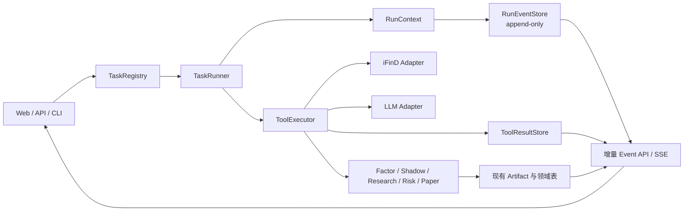

# 结构化金融 Task、统一事件协议与 ToolResult 融入方案

> 状态：M10.0 已实施；M10.1-M10.3 Proposed  
> 目标版本：M10.0-M10.3  
> 适用范围：当前 FastAPI + Python + SQLite 单体  
> 核心约束：不引入 DojoAgents 运行时，不引入自由 Agent 主链，不改变 Evidence-first、确定性风险引擎和人工审批边界。

## 1. 决策摘要

迹研应吸收 DojoAgents 的合同思想，而不是接入其通用 Agent Loop。新增三层薄协议：

1. **Task Contract**：把每日研究的输入、步骤、依赖、产物和验收条件从 `main.py` 中提取为可版本化定义；
2. **Run Event**：用统一 `run_id + seq + call_id` 串联批次、步骤、iFinD、LLM、Artifact、风险门禁、人工审批和模拟成交；
3. **ToolResult**：所有外部调用和重要确定性算子返回统一结构，明确数据、Artifact、资源变化、耗时和错误。

现有 `DailyBatchRunner`、`ResearchRun`、`paper_daily_run`、iFinD 韧性逻辑和 LLM 韧性逻辑继续保留。迁移采用旁路记录和兼容投影，禁止同时存在两套可写业务状态来源。

## 2. 现状与问题

当前系统已经具备：

- `paper_daily_batch` / `paper_daily_batch_step` 持久化六步状态；
- 同日同配置幂等、失败续跑和服务重启恢复；
- `ResearchRun`、ResearchArtifact、Current Shadow、PaperRun 等领域运行记录；
- iFinD 调用事件、超时、重试、退避和熔断；
- LLM 超时、重试、退避、熔断和进程内指标；
- 前端每 2 秒轮询完整批次状态。

主要缺口：

- 六个步骤由 Python 常量定义，输入输出合同散落在 handler 中；
- iFinD、LLM、ResearchRun、PaperRun 和 BatchRun 没有共同根运行 ID；
- iFinD 事件无法定位由哪个批次和步骤触发，LLM 指标尚未持久化到统一账本；
- handler 返回任意 `dict`，无法统一表达 Artifact、资源变化、截断和结构化错误；
- 前端按 `step_name` 猜测展示语义，刷新时重复获取整个批次；
- 服务重启后能恢复步骤状态，但不能完整回放工具调用过程。

## 3. 目标架构



职责边界：

- TaskRunner 只负责步骤依赖、状态、恢复和合同校验；
- ToolExecutor 只负责调用关联、结果归一化、事件和脱敏；
- iFinD/LLM 适配器继续拥有各自超时、重试和熔断，第一阶段不得叠加第二套重试；
- 领域服务继续负责金融正确性、point-in-time、数据质量和业务事务；
- LLM 不能通过 ToolResult 直接修改订单、仓位、准入结果或 Evidence。

## 4. Task Contract

### 4.1 文件结构

```text
app/
├── runtime/
│   ├── contracts.py
│   ├── events.py
│   ├── tools.py
│   ├── task_registry.py
│   └── task_runner.py
└── task_specs/
    └── daily_research_v1.yaml
```

Task 定义保存在代码仓库中并随版本发布。数据库只保存定义标识、版本、规范化输入和合同哈希，不允许在生产页面临时编辑 Task。

### 4.2 每日研究 Task 示例

```yaml
task_key: daily_research
contract_version: "1.0"
runner_version: "task-runner-v1"
input_schema: paper-daily-batch-input-v1
output_schema: paper-daily-batch-output-v1
idempotency:
  fields: [account_id, as_of, config_hash, contract_hash]
steps:
  - key: market_data
    tool: market.ensure_daily_data
    provides: [market_data_snapshot]
  - key: factor_snapshot
    tool: quant.generate_factor_snapshot
    requires: [market_data_snapshot]
    provides: [factor_snapshot]
  - key: current_shadow
    tool: quant.generate_current_shadow
    requires: [factor_snapshot]
    provides: [current_shadow_snapshot]
  - key: candidate_research
    tool: research.assess_candidates_and_holdings
    requires: [factor_snapshot, current_shadow_snapshot]
    provides: [research_assessments]
  - key: holdings_review
    tool: portfolio.review_holdings
    requires: [research_assessments]
    provides: [holdings_review]
  - key: order_proposals
    tool: paper.propose_orders
    requires: [holdings_review]
    provides: [paper_daily_run]
```

### 4.3 合同模型

```python
class TaskSpec(BaseModel):
    task_key: str
    contract_version: str
    runner_version: str
    input_schema: str
    output_schema: str
    steps: list[TaskStepSpec]
    contract_hash: str

class TaskStepSpec(BaseModel):
    key: str
    tool: str
    requires: list[str] = []
    provides: list[str] = []
    timeout_seconds: float | None = None
```

TaskRegistry 启动时完成以下校验：

- step key 和 tool name 唯一；
- `requires` 必须由上游 `provides` 满足；
- 输入输出 Schema 存在；
- Task 文件规范化后计算 SHA-256；
- 循环依赖、未知工具或未知 Schema 直接阻止服务启动。

### 4.4 幂等与恢复

幂等键改为：

```text
task_key + contract_version + contract_hash
+ account_id + as_of + canonical_input_hash
```

恢复某一步前必须同时满足：

- 上次 step 状态为 `completed`；
- step 对应 tool version 未变化；
- 输入引用的 Artifact hash 未变化；
- ToolResult hash 校验通过；
- step 输出 Schema 仍兼容。

任一条件失败时，从该步骤开始重新执行，下游结果全部标记为 `superseded`，不得静默复用。

## 5. 统一事件协议

### 5.1 EventEnvelope

```python
class RunEvent(BaseModel):
    schema_version: Literal["research.event.v1"]
    event_id: UUID
    root_run_id: UUID
    seq: int
    parent_run_id: str | None
    domain_run_id: str | None
    step_run_id: UUID | None
    call_id: UUID | None
    event_type: str
    status: str | None
    occurred_at: datetime
    payload: dict
    payload_hash: str
```

标识语义：

- `root_run_id`：一次用户动作的根运行，完整日批次中等于 TaskRun ID；
- `parent_run_id`：父任务或父步骤，用于后续嵌套 Task；
- `domain_run_id`：现有 `ResearchRun`、`PaperRun`、Shadow snapshot 等领域标识；
- `step_run_id`：一次步骤尝试；
- `call_id`：一次工具调用，`tool_started` 与 `tool_completed/tool_failed` 必须一致。

### 5.2 事件类型

第一版只允许白名单类型：

```text
task_queued          task_started        task_completed       task_failed
step_started         step_reused         step_completed       step_failed
tool_started         tool_retrying       tool_completed       tool_failed
artifact_created     gate_evaluated      resource_changed
human_reviewed       order_proposed      order_filled         order_skipped
```

事件只记录可审计事实，不记录模型隐式思维过程。LLM prompt、完整公告文本和大体积结果只保存哈希或 Artifact 引用。

### 5.3 SQLite 表

```sql
CREATE TABLE runtime_run (
    root_run_id TEXT PRIMARY KEY,
    task_key TEXT NOT NULL,
    contract_version TEXT NOT NULL,
    contract_hash TEXT NOT NULL,
    input_json TEXT NOT NULL,
    input_hash TEXT NOT NULL,
    status TEXT NOT NULL,
    domain_type TEXT,
    domain_id TEXT,
    next_seq INTEGER NOT NULL DEFAULT 1,
    created_at TEXT NOT NULL,
    started_at TEXT,
    finished_at TEXT,
    UNIQUE(task_key, contract_version, contract_hash, input_hash)
);

CREATE TABLE runtime_step_run (
    step_run_id TEXT PRIMARY KEY,
    root_run_id TEXT NOT NULL,
    step_key TEXT NOT NULL,
    ordinal INTEGER NOT NULL,
    attempt INTEGER NOT NULL,
    tool_name TEXT NOT NULL,
    tool_version TEXT NOT NULL,
    input_hash TEXT NOT NULL,
    status TEXT NOT NULL,
    result_id TEXT,
    error_code TEXT,
    started_at TEXT NOT NULL,
    finished_at TEXT,
    UNIQUE(root_run_id, step_key, attempt),
    FOREIGN KEY(root_run_id) REFERENCES runtime_run(root_run_id)
);

CREATE TABLE runtime_event (
    event_id TEXT PRIMARY KEY,
    schema_version TEXT NOT NULL,
    root_run_id TEXT NOT NULL,
    seq INTEGER NOT NULL,
    parent_run_id TEXT,
    domain_run_id TEXT,
    step_run_id TEXT,
    call_id TEXT,
    event_type TEXT NOT NULL,
    status TEXT,
    occurred_at TEXT NOT NULL,
    payload_json TEXT NOT NULL,
    payload_hash TEXT NOT NULL,
    UNIQUE(root_run_id, seq),
    FOREIGN KEY(root_run_id) REFERENCES runtime_run(root_run_id)
);
```

SQLite 中分配 `seq` 必须在 `BEGIN IMMEDIATE` 事务内递增 `runtime_run.next_seq`，禁止使用 `MAX(seq)+1`。事件追加成功和对应状态更新应处于同一事务；事件表不允许 UPDATE 或 DELETE。

`runtime_run.input_json` 只保存通过输入 Schema 和 redactor 的规范化参数；密码、Token、完整 prompt、文件正文和任意未声明字段不得进入该列。`runtime_step_run` 是断点恢复的权威步骤索引，`runtime_event` 是追加式审计时间线，两者在同一事务内写入。

### 5.4 API

```text
GET /api/runtime/runs/{root_run_id}
GET /api/runtime/runs/{root_run_id}/events?after_seq=42&limit=200
GET /api/runtime/runs/{root_run_id}/events/stream?after_seq=42
```

第一阶段前端继续 2 秒轮询，但只拉取 `after_seq` 之后的增量事件；M10.3 再切换 SSE。SSE 断线重连时携带最后已处理序号，前端按 `(root_run_id, seq)` 去重和排序。

## 6. ToolResult 标准

### 6.1 ToolSpec 与 ToolContext

```python
class ToolSpec(BaseModel):
    name: str
    version: str
    input_model: type[BaseModel]
    output_schema: str
    side_effect: Literal["read", "append", "mutate"]
    allowed_resource_types: set[str]

class ToolContext(BaseModel):
    root_run_id: UUID
    step_run_id: UUID
    call_id: UUID
    as_of: date
    actor: Literal["system", "human", "model"]
    account_id: str | None
```

### 6.2 ToolResult

```python
class ToolResult(BaseModel):
    schema_version: Literal["tool-result-v1"]
    result_id: UUID
    call_id: UUID
    tool_name: str
    tool_version: str
    ok: bool
    data: dict | list | None
    artifacts: list[ArtifactRef]
    resource_changes: list[ResourceChange]
    metrics: ToolMetrics
    error: ToolError | None
    truncated: bool = False
    result_hash: str
```

```python
class ToolError(BaseModel):
    code: str
    category: str
    message: str
    retryable: bool
    attempt: int
    upstream_code: str | None

class ResourceChange(BaseModel):
    resource_type: str
    resource_id: str
    action: Literal["created", "updated", "superseded", "cancelled"]
    version: str | None
```

`metrics`至少包含 `started_at`、`finished_at`、`latency_ms`、`attempts`、`rows_in`、`rows_out`。敏感参数、账号、密码、API Key、完整 prompt 和完整原文不得进入结果表。

### 6.3 持久化

```sql
CREATE TABLE tool_call_result (
    result_id TEXT PRIMARY KEY,
    root_run_id TEXT NOT NULL,
    step_run_id TEXT NOT NULL,
    call_id TEXT NOT NULL UNIQUE,
    tool_name TEXT NOT NULL,
    tool_version TEXT NOT NULL,
    ok INTEGER NOT NULL,
    result_json TEXT NOT NULL,
    result_hash TEXT NOT NULL,
    latency_ms INTEGER NOT NULL,
    attempts INTEGER NOT NULL,
    error_category TEXT,
    created_at TEXT NOT NULL,
    FOREIGN KEY(root_run_id) REFERENCES runtime_run(root_run_id)
);
```

ToolResult 保存摘要和引用，业务数据继续写入现有领域表。不得把行情、公告正文、因子全表或 LLM 大结果复制到 ToolResult JSON。

### 6.4 适配顺序

| 工具名 | 现有入口 | 首版返回的 Artifact / ResourceChange |
|---|---|---|
| `market.ensure_daily_data` | `ensure_market_data` | 行情指纹、更新区间、质量结果；`market_data` updated |
| `quant.generate_factor_snapshot` | `FactorSnapshotService.generate` | factor snapshot ID/hash |
| `quant.generate_current_shadow` | `CurrentShadowService.generate` | shadow snapshot、model/validation ID |
| `research.assess_candidates_and_holdings` | `build_paper_research_assessments` | ResearchRun 与 assessment Artifact refs |
| `portfolio.review_holdings` | `PaperTradingService.review_holdings` | review snapshot/hash |
| `paper.propose_orders` | `PaperTradingService.create_daily_run` | PaperRun、order IDs；orders created/cancelled |
| `ifind.*` | `IFindService._execute` | rows/count/fingerprint，不保存原始凭据 |
| `llm.generate_*` | `llm.py` 公共生成函数 | model、usage、response hash、Artifact refs |

第一版 ToolExecutor 只包裹调用并记录关联信息。iFinD 和 LLM 内部现有重试/熔断保持唯一实现，ToolExecutor 不重试，避免重试次数相乘。

## 7. 与现有模型的关系

```text
runtime_run.root_run_id
├── paper_daily_batch.batch_id        兼容领域投影
├── research_run.run_id               domain_run_id
├── current_shadow_snapshot.snapshot_id
├── paper_daily_run.run_id
├── runtime_event[]                   统一时间线
└── tool_call_result[]                工具审计
```

约束：

- `runtime_run` 负责技术运行状态和事件序号；
- 现有领域表继续负责金融业务事实；
- `paper_daily_batch` 在迁移期作为兼容投影，由 TaskRunner 单向更新；
- API 不允许分别修改 `runtime_run` 和 `paper_daily_batch`；
- 人工订单审批继续写入 `paper_order`，同时追加 `human_reviewed/resource_changed` 事件；
- Event 和 ToolResult 不能覆盖 Evidence、DecisionCase、ResearchArtifact 或订单状态。

## 8. 前端融合

前端新增通用 EventReducer，不再根据工具名称猜状态：

```javascript
state.runtimeRuns[rootRunId] = {
  lastSeq,
  status,
  phases,
  steps,
  calls,
  artifacts,
  resourceChanges,
  errors,
};
```

页面变化：

- 六步进度条继续保留；
- 每一步可展开显示耗时、重试次数、ToolResult状态和Artifact引用；
- 错误显示稳定 `error.code/category`，详细脱敏信息按需展开；
- `resource_changes` 触发定向刷新持仓、订单、Shadow或ResearchRun；
- 页面刷新后通过事件账本恢复，不依赖内存定时器；
- 人工审批与自动批次在时间线上明确分区。

## 9. 分阶段实施

### M10.0：统一事件账本

**状态：已完成（2026-07-23）。**

- 新增 `runtime_run`、`runtime_event`、EventEmitter；
- `DailyBatchRunner` 在现有状态写入旁边追加 Task/Step事件；
- iFinD observer 增加可选 `root_run_id/step_run_id/call_id`；
- LLM生成入口持久化 started/completed/failed 事件；
- 新增增量 Event API，前端仍保持原轮询作为回退。

实际实现同时增加 `runtime_step_run` 作为步骤尝试索引，使用 `ContextVar`
传播 `root_run_id / step_run_id`，并将一次 iFinD 或 LLM 调用的重试事件绑定到同一
`call_id`。事件类型执行白名单校验；payload 递归脱敏、限制为 64KB 并保存
SHA-256；根运行内的 `seq` 通过 `BEGIN IMMEDIATE` 连续分配。增量 GET API 使用
多取一条的方式准确返回 `has_more`，不把“刚好达到 limit”误判为仍有后续。

兼容边界保持不变：`paper_daily_batch` 仍作为现有业务投影，iFinD/LLM 继续使用原有
超时、有限重试、退避和熔断，没有叠加第二层重试。M10.0 不建立 ToolResult 表，
不引入 YAML Task、SSE、通用 Agent Loop 或 Multi-Agent。

验收：7月23日完整批次可按单一 root run 回放六步、iFinD、LLM、Artifact和订单提案；重启后事件序号连续且不重复。

自动化验收覆盖批次完成、失败续跑、服务重启恢复、并发序号、事件哈希、payload
脱敏与截断、事件白名单、iFinD/LLM call ID 关联和增量 API。实施后的全量测试为
`124 passed`。

### M10.1：ToolResult 标准化

- 建立 ToolRegistry、ToolContext、ToolExecutor 和结果表；
- 先适配 iFinD、LLM，再适配六个日批次步骤；
- handler 由任意 `dict` 迁移为 `ToolResult`；
- `DailyBatchRunner` 在兼容期把 `ToolResult.data` 投影回原 `result_json`。

验收：所有步骤都有 call ID、耗时、尝试次数、结构化错误和结果哈希；不得出现双重重试。

### M10.2：声明式 Task Contract

- 引入 TaskSpec、SchemaRegistry 和 `daily_research_v1.yaml`；
- TaskRunner 根据依赖图执行，不再依赖 `DAILY_BATCH_STEPS` 常量；
- 将现有 `paper_daily_batch` API 改为 TaskRun 的兼容视图；
- 增加 `task validate` 和 `task replay --no-external-calls` 运维命令。

验收：修改步骤顺序、输入Schema或工具版本会改变合同哈希并阻止错误复用；旧API和页面测试继续通过。

### M10.3：增量事件 UI 与 SSE

- 前端使用 EventReducer；
- 增加断线重连、`after_seq` 补偿和事件去重；
- 保留 GET 批次快照接口作为冷启动和故障回退；
- 加入按 step/call 展开的审计时间线。

验收：浏览器刷新和服务重启后均能恢复同一运行；SSE中断不丢事件、不重复显示订单或错误。

## 10. 数据迁移

历史运行不伪造工具事件。对旧批次只生成一条：

```text
event_type = legacy_snapshot_imported
payload = {batch_id, batch_version, status, step_snapshot_hash}
```

新运行才记录完整事件。迁移脚本必须：

- 可重复执行；
- 不修改现有业务表历史值；
- 为每个旧运行保存来源表和快照哈希；
- 遇到损坏 JSON 时隔离并报告，不补造内容。

## 11. 测试与验收矩阵

| 范围 | 必测行为 |
|---|---|
| Task合同 | 未知工具、循环依赖、缺失Schema、合同hash变化 |
| 幂等恢复 | 同输入复用、工具版本变化失效、下游supersede |
| Event | seq并发唯一、追加不可变、重启连续、payload hash |
| ToolResult | Schema校验、错误归类、脱敏、截断、Artifact引用 |
| 韧性 | iFinD/LLM只执行一层有限重试，熔断事件完整 |
| point-in-time | `as_of`强制传递，禁止工具读取未来数据 |
| 权限边界 | LLM工具不能产生订单或覆盖准入结果 |
| 前端 | 增量拉取、SSE重连、事件去重、资源定向刷新 |
| 兼容性 | 原每日批次API、页面、116项基线测试继续通过 |
| 真实回放 | 7月23日批次离线回放不调用外部服务，结果引用一致 |

## 12. 风险与控制

| 风险 | 控制 |
|---|---|
| 双重状态源 | runtime为技术状态唯一写入口，旧表只做单向兼容投影 |
| SQLite写竞争 | 短事务、`BEGIN IMMEDIATE`分配seq、事件payload限64KB |
| 事件泄露敏感信息 | 字段白名单、统一redactor、只存prompt/result hash |
| 重试次数相乘 | 首版ToolExecutor不重试，沿用iFinD/LLM现有韧性实现 |
| 日志替代业务事实 | Event只做审计；Evidence、Artifact、订单仍由领域表负责 |
| Task配置漂移 | Task文件入库、启动校验、contract hash绑定运行 |
| 前端过度依赖SSE | 快照GET和增量GET永久保留为回退 |

## 13. 明确延期

本方案不包含：

- 通用 Agent Loop；
- Multi-Agent自动委派；
- 模型自动生成或修改Task；
- Cron、消息网关和每日无人值守执行；
- Redis、Celery、Kafka或独立事件服务；
- 自动交易与券商接口；
- 把完整思维过程写入事件账本。

当单机 SQLite 出现持续写锁、多个Worker并发或跨机器执行需求后，再评估任务队列和外部事件基础设施。

## 14. 推荐实施顺序

优先实施 M10.0，不先做声明式Task。原因是统一事件上下文是另外两层的共同地基，也能立即解决当前“跨iFinD/LLM/API缺少统一trace ID”的问题。

```text
M10.0 EventEnvelope + EventStore
→ M10.1 ToolContext + ToolResult
→ M10.2 daily_research TaskSpec
→ M10.3 EventReducer + SSE
```

每一阶段必须独立可回滚：关闭功能开关后，现有 DailyBatchRunner、批次API和前端轮询仍可工作。

建议功能开关：

```text
RUNTIME_EVENTS_ENABLED
TOOL_RESULTS_ENABLED
TASK_CONTRACTS_ENABLED
RUNTIME_SSE_ENABLED
```

开关按上述顺序启用；后一个开关不得在前一个尚未通过真实批次验收时开启。
